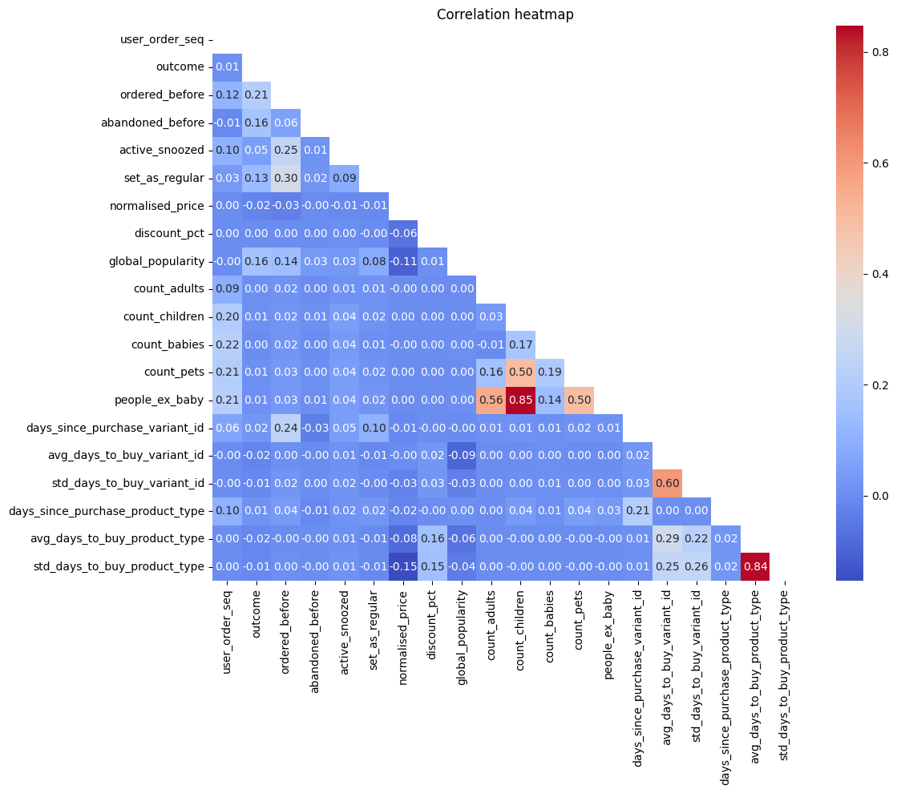

# Complete exploratory data analysis notebook

Author: Maria Jorda

Date: 22 Feb 2026

In this notebook we carry out a comprehensive exploratory data analysis for a dataset containing data of an E-commerce


```python
import pandas as pd
import matplotlib.pyplot as plt
import seaborn as sns
import numpy as np
```

## Data download


```python
# In order to pull the data you need to have the files in a folder in the same directory as this notebook. If you have the data in a different location, you can change the path in the code below.
relative_path="module_2_datasets/"
```


```python
df_orders = pd.read_csv(f'{relative_path}feature_frame.csv')
print(df_orders.shape)
df_orders.head()
```

    (2880549, 27)


<div>
<style scoped>
    .dataframe tbody tr th:only-of-type {
        vertical-align: middle;
    }

    .dataframe tbody tr th {
        vertical-align: top;
    }

    .dataframe thead th {
        text-align: right;
    }
</style>
<table border="1" class="dataframe">
  <thead>
    <tr style="text-align: right;">
      <th></th>
      <th>variant_id</th>
      <th>product_type</th>
      <th>order_id</th>
      <th>user_id</th>
      <th>created_at</th>
      <th>order_date</th>
      <th>user_order_seq</th>
      <th>outcome</th>
      <th>ordered_before</th>
      <th>abandoned_before</th>
      <th>...</th>
      <th>count_children</th>
      <th>count_babies</th>
      <th>count_pets</th>
      <th>people_ex_baby</th>
      <th>days_since_purchase_variant_id</th>
      <th>avg_days_to_buy_variant_id</th>
      <th>std_days_to_buy_variant_id</th>
      <th>days_since_purchase_product_type</th>
      <th>avg_days_to_buy_product_type</th>
      <th>std_days_to_buy_product_type</th>
    </tr>
  </thead>
  <tbody>
    <tr>
      <th>0</th>
      <td>33826472919172</td>
      <td>ricepastapulses</td>
      <td>2807985930372</td>
      <td>3482464092292</td>
      <td>2020-10-05 16:46:19</td>
      <td>2020-10-05 00:00:00</td>
      <td>3</td>
      <td>0.0</td>
      <td>0.0</td>
      <td>0.0</td>
      <td>...</td>
      <td>0.0</td>
      <td>0.0</td>
      <td>0.0</td>
      <td>2.0</td>
      <td>33.0</td>
      <td>42.0</td>
      <td>31.134053</td>
      <td>30.0</td>
      <td>30.0</td>
      <td>24.27618</td>
    </tr>
    <tr>
      <th>1</th>
      <td>33826472919172</td>
      <td>ricepastapulses</td>
      <td>2808027644036</td>
      <td>3466586718340</td>
      <td>2020-10-05 17:59:51</td>
      <td>2020-10-05 00:00:00</td>
      <td>2</td>
      <td>0.0</td>
      <td>0.0</td>
      <td>0.0</td>
      <td>...</td>
      <td>0.0</td>
      <td>0.0</td>
      <td>0.0</td>
      <td>2.0</td>
      <td>33.0</td>
      <td>42.0</td>
      <td>31.134053</td>
      <td>30.0</td>
      <td>30.0</td>
      <td>24.27618</td>
    </tr>
    <tr>
      <th>2</th>
      <td>33826472919172</td>
      <td>ricepastapulses</td>
      <td>2808099078276</td>
      <td>3481384026244</td>
      <td>2020-10-05 20:08:53</td>
      <td>2020-10-05 00:00:00</td>
      <td>4</td>
      <td>0.0</td>
      <td>0.0</td>
      <td>0.0</td>
      <td>...</td>
      <td>0.0</td>
      <td>0.0</td>
      <td>0.0</td>
      <td>2.0</td>
      <td>33.0</td>
      <td>42.0</td>
      <td>31.134053</td>
      <td>30.0</td>
      <td>30.0</td>
      <td>24.27618</td>
    </tr>
    <tr>
      <th>3</th>
      <td>33826472919172</td>
      <td>ricepastapulses</td>
      <td>2808393957508</td>
      <td>3291363377284</td>
      <td>2020-10-06 08:57:59</td>
      <td>2020-10-06 00:00:00</td>
      <td>2</td>
      <td>0.0</td>
      <td>0.0</td>
      <td>0.0</td>
      <td>...</td>
      <td>0.0</td>
      <td>0.0</td>
      <td>0.0</td>
      <td>2.0</td>
      <td>33.0</td>
      <td>42.0</td>
      <td>31.134053</td>
      <td>30.0</td>
      <td>30.0</td>
      <td>24.27618</td>
    </tr>
    <tr>
      <th>4</th>
      <td>33826472919172</td>
      <td>ricepastapulses</td>
      <td>2808429314180</td>
      <td>3537167515780</td>
      <td>2020-10-06 10:37:05</td>
      <td>2020-10-06 00:00:00</td>
      <td>3</td>
      <td>0.0</td>
      <td>0.0</td>
      <td>0.0</td>
      <td>...</td>
      <td>0.0</td>
      <td>0.0</td>
      <td>0.0</td>
      <td>2.0</td>
      <td>33.0</td>
      <td>42.0</td>
      <td>31.134053</td>
      <td>30.0</td>
      <td>30.0</td>
      <td>24.27618</td>
    </tr>
  </tbody>
</table>
<p>5 rows × 27 columns</p>
</div>


## Sanity checks


### 1. Data types


```python
df_orders.dtypes
```


    variant_id                            int64
    product_type                         object
    order_id                              int64
    user_id                               int64
    created_at                           object
    order_date                           object
    user_order_seq                        int64
    outcome                             float64
    ordered_before                      float64
    abandoned_before                    float64
    active_snoozed                      float64
    set_as_regular                      float64
    normalised_price                    float64
    discount_pct                        float64
    vendor                               object
    global_popularity                   float64
    count_adults                        float64
    count_children                      float64
    count_babies                        float64
    count_pets                          float64
    people_ex_baby                      float64
    days_since_purchase_variant_id      float64
    avg_days_to_buy_variant_id          float64
    std_days_to_buy_variant_id          float64
    days_since_purchase_product_type    float64
    avg_days_to_buy_product_type        float64
    std_days_to_buy_product_type        float64
    dtype: object


```python
df_orders.describe()
```


<div>
<style scoped>
    .dataframe tbody tr th:only-of-type {
        vertical-align: middle;
    }

    .dataframe tbody tr th {
        vertical-align: top;
    }

    .dataframe thead th {
        text-align: right;
    }
</style>
<table border="1" class="dataframe">
  <thead>
    <tr style="text-align: right;">
      <th></th>
      <th>variant_id</th>
      <th>order_id</th>
      <th>user_id</th>
      <th>user_order_seq</th>
      <th>outcome</th>
      <th>ordered_before</th>
      <th>abandoned_before</th>
      <th>active_snoozed</th>
      <th>set_as_regular</th>
      <th>normalised_price</th>
      <th>...</th>
      <th>count_children</th>
      <th>count_babies</th>
      <th>count_pets</th>
      <th>people_ex_baby</th>
      <th>days_since_purchase_variant_id</th>
      <th>avg_days_to_buy_variant_id</th>
      <th>std_days_to_buy_variant_id</th>
      <th>days_since_purchase_product_type</th>
      <th>avg_days_to_buy_product_type</th>
      <th>std_days_to_buy_product_type</th>
    </tr>
  </thead>
  <tbody>
    <tr>
      <th>count</th>
      <td>2.880549e+06</td>
      <td>2.880549e+06</td>
      <td>2.880549e+06</td>
      <td>2.880549e+06</td>
      <td>2.880549e+06</td>
      <td>2.880549e+06</td>
      <td>2.880549e+06</td>
      <td>2.880549e+06</td>
      <td>2.880549e+06</td>
      <td>2.880549e+06</td>
      <td>...</td>
      <td>2.880549e+06</td>
      <td>2.880549e+06</td>
      <td>2.880549e+06</td>
      <td>2.880549e+06</td>
      <td>2.880549e+06</td>
      <td>2.880549e+06</td>
      <td>2.880549e+06</td>
      <td>2.880549e+06</td>
      <td>2.880549e+06</td>
      <td>2.880549e+06</td>
    </tr>
    <tr>
      <th>mean</th>
      <td>3.401250e+13</td>
      <td>2.978388e+12</td>
      <td>3.750025e+12</td>
      <td>3.289342e+00</td>
      <td>1.153669e-02</td>
      <td>2.113868e-02</td>
      <td>6.092589e-04</td>
      <td>2.290188e-03</td>
      <td>3.629864e-03</td>
      <td>1.272808e-01</td>
      <td>...</td>
      <td>5.492182e-02</td>
      <td>3.538562e-03</td>
      <td>5.134091e-02</td>
      <td>2.072549e+00</td>
      <td>3.312961e+01</td>
      <td>3.523734e+01</td>
      <td>2.645304e+01</td>
      <td>3.143513e+01</td>
      <td>3.088810e+01</td>
      <td>2.594969e+01</td>
    </tr>
    <tr>
      <th>std</th>
      <td>2.786246e+11</td>
      <td>2.446292e+11</td>
      <td>1.775710e+11</td>
      <td>2.140176e+00</td>
      <td>1.067876e-01</td>
      <td>1.438466e-01</td>
      <td>2.467565e-02</td>
      <td>4.780109e-02</td>
      <td>6.013891e-02</td>
      <td>1.268378e-01</td>
      <td>...</td>
      <td>3.276586e-01</td>
      <td>5.938048e-02</td>
      <td>3.013646e-01</td>
      <td>3.943659e-01</td>
      <td>3.707162e+00</td>
      <td>1.057766e+01</td>
      <td>7.168323e+00</td>
      <td>1.227511e+01</td>
      <td>4.330262e+00</td>
      <td>3.278860e+00</td>
    </tr>
    <tr>
      <th>min</th>
      <td>3.361529e+13</td>
      <td>2.807986e+12</td>
      <td>3.046041e+12</td>
      <td>2.000000e+00</td>
      <td>0.000000e+00</td>
      <td>0.000000e+00</td>
      <td>0.000000e+00</td>
      <td>0.000000e+00</td>
      <td>0.000000e+00</td>
      <td>1.599349e-02</td>
      <td>...</td>
      <td>0.000000e+00</td>
      <td>0.000000e+00</td>
      <td>0.000000e+00</td>
      <td>1.000000e+00</td>
      <td>0.000000e+00</td>
      <td>0.000000e+00</td>
      <td>1.414214e+00</td>
      <td>0.000000e+00</td>
      <td>7.000000e+00</td>
      <td>2.828427e+00</td>
    </tr>
    <tr>
      <th>25%</th>
      <td>3.380354e+13</td>
      <td>2.875152e+12</td>
      <td>3.745901e+12</td>
      <td>2.000000e+00</td>
      <td>0.000000e+00</td>
      <td>0.000000e+00</td>
      <td>0.000000e+00</td>
      <td>0.000000e+00</td>
      <td>0.000000e+00</td>
      <td>5.394416e-02</td>
      <td>...</td>
      <td>0.000000e+00</td>
      <td>0.000000e+00</td>
      <td>0.000000e+00</td>
      <td>2.000000e+00</td>
      <td>3.300000e+01</td>
      <td>3.000000e+01</td>
      <td>2.319372e+01</td>
      <td>3.000000e+01</td>
      <td>2.800000e+01</td>
      <td>2.427618e+01</td>
    </tr>
    <tr>
      <th>50%</th>
      <td>3.397325e+13</td>
      <td>2.902856e+12</td>
      <td>3.812775e+12</td>
      <td>3.000000e+00</td>
      <td>0.000000e+00</td>
      <td>0.000000e+00</td>
      <td>0.000000e+00</td>
      <td>0.000000e+00</td>
      <td>0.000000e+00</td>
      <td>8.105178e-02</td>
      <td>...</td>
      <td>0.000000e+00</td>
      <td>0.000000e+00</td>
      <td>0.000000e+00</td>
      <td>2.000000e+00</td>
      <td>3.300000e+01</td>
      <td>3.400000e+01</td>
      <td>2.769305e+01</td>
      <td>3.000000e+01</td>
      <td>3.100000e+01</td>
      <td>2.608188e+01</td>
    </tr>
    <tr>
      <th>75%</th>
      <td>3.428495e+13</td>
      <td>2.922034e+12</td>
      <td>3.874925e+12</td>
      <td>4.000000e+00</td>
      <td>0.000000e+00</td>
      <td>0.000000e+00</td>
      <td>0.000000e+00</td>
      <td>0.000000e+00</td>
      <td>0.000000e+00</td>
      <td>1.352670e-01</td>
      <td>...</td>
      <td>0.000000e+00</td>
      <td>0.000000e+00</td>
      <td>0.000000e+00</td>
      <td>2.000000e+00</td>
      <td>3.300000e+01</td>
      <td>4.000000e+01</td>
      <td>3.059484e+01</td>
      <td>3.000000e+01</td>
      <td>3.400000e+01</td>
      <td>2.796118e+01</td>
    </tr>
    <tr>
      <th>max</th>
      <td>3.454300e+13</td>
      <td>3.643302e+12</td>
      <td>5.029635e+12</td>
      <td>2.100000e+01</td>
      <td>1.000000e+00</td>
      <td>1.000000e+00</td>
      <td>1.000000e+00</td>
      <td>1.000000e+00</td>
      <td>1.000000e+00</td>
      <td>1.000000e+00</td>
      <td>...</td>
      <td>3.000000e+00</td>
      <td>1.000000e+00</td>
      <td>6.000000e+00</td>
      <td>5.000000e+00</td>
      <td>1.480000e+02</td>
      <td>8.400000e+01</td>
      <td>5.868986e+01</td>
      <td>1.480000e+02</td>
      <td>3.950000e+01</td>
      <td>3.564191e+01</td>
    </tr>
  </tbody>
</table>
<p>8 rows × 23 columns</p>
</div>


We should change the datatype of 'created_at' and 'order_date' because they're datetimes. Additionaly, I think it's better for boolean values to be intergers, not floats, so I'll also change the data types of boolean values. To know which variables are boolean we check the max and min of the variables (they should be 1 and 0 respectively) or the .value_counts() of the variables. I'll also change other float variables like 'count_adults' to interger.


```python
df_orders['created_at'] = df_orders['created_at'].astype('datetime64[ns]')
df_orders['order_date'] = df_orders['order_date'].astype('datetime64[ns]')
```


```python
print(df_orders['avg_days_to_buy_variant_id'].value_counts())
```

    avg_days_to_buy_variant_id
    34.0    274971
    30.0    150497
    32.0    128927
    38.0    122523
    31.0    109710
             ...  
    12.5      1460
    10.5      1431
    1.0        946
    4.5        817
    9.5        594
    Name: count, Length: 122, dtype: int64


```python
boolean_columns = df_orders[['outcome', 'ordered_before', 'abandoned_before', 'active_snoozed', 'set_as_regular']]
interger_columns = df_orders[['days_since_purchase_variant_id', 'days_since_purchase_product_type', 'count_adults', 'count_children', 'count_babies', 'count_pets', 'people_ex_baby']]

for column in boolean_columns:
    df_orders[column] = df_orders[column].astype('int64')

for column in interger_columns:
    df_orders[column] = df_orders[column].astype('int64')
```


```python
df_orders.head()
```


<div>
<style scoped>
    .dataframe tbody tr th:only-of-type {
        vertical-align: middle;
    }

    .dataframe tbody tr th {
        vertical-align: top;
    }

    .dataframe thead th {
        text-align: right;
    }
</style>
<table border="1" class="dataframe">
  <thead>
    <tr style="text-align: right;">
      <th></th>
      <th>variant_id</th>
      <th>product_type</th>
      <th>order_id</th>
      <th>user_id</th>
      <th>created_at</th>
      <th>order_date</th>
      <th>user_order_seq</th>
      <th>outcome</th>
      <th>ordered_before</th>
      <th>abandoned_before</th>
      <th>...</th>
      <th>count_children</th>
      <th>count_babies</th>
      <th>count_pets</th>
      <th>people_ex_baby</th>
      <th>days_since_purchase_variant_id</th>
      <th>avg_days_to_buy_variant_id</th>
      <th>std_days_to_buy_variant_id</th>
      <th>days_since_purchase_product_type</th>
      <th>avg_days_to_buy_product_type</th>
      <th>std_days_to_buy_product_type</th>
    </tr>
  </thead>
  <tbody>
    <tr>
      <th>0</th>
      <td>33826472919172</td>
      <td>ricepastapulses</td>
      <td>2807985930372</td>
      <td>3482464092292</td>
      <td>2020-10-05 16:46:19</td>
      <td>2020-10-05</td>
      <td>3</td>
      <td>0</td>
      <td>0</td>
      <td>0</td>
      <td>...</td>
      <td>0</td>
      <td>0</td>
      <td>0</td>
      <td>2</td>
      <td>33</td>
      <td>42.0</td>
      <td>31.134053</td>
      <td>30</td>
      <td>30.0</td>
      <td>24.27618</td>
    </tr>
    <tr>
      <th>1</th>
      <td>33826472919172</td>
      <td>ricepastapulses</td>
      <td>2808027644036</td>
      <td>3466586718340</td>
      <td>2020-10-05 17:59:51</td>
      <td>2020-10-05</td>
      <td>2</td>
      <td>0</td>
      <td>0</td>
      <td>0</td>
      <td>...</td>
      <td>0</td>
      <td>0</td>
      <td>0</td>
      <td>2</td>
      <td>33</td>
      <td>42.0</td>
      <td>31.134053</td>
      <td>30</td>
      <td>30.0</td>
      <td>24.27618</td>
    </tr>
    <tr>
      <th>2</th>
      <td>33826472919172</td>
      <td>ricepastapulses</td>
      <td>2808099078276</td>
      <td>3481384026244</td>
      <td>2020-10-05 20:08:53</td>
      <td>2020-10-05</td>
      <td>4</td>
      <td>0</td>
      <td>0</td>
      <td>0</td>
      <td>...</td>
      <td>0</td>
      <td>0</td>
      <td>0</td>
      <td>2</td>
      <td>33</td>
      <td>42.0</td>
      <td>31.134053</td>
      <td>30</td>
      <td>30.0</td>
      <td>24.27618</td>
    </tr>
    <tr>
      <th>3</th>
      <td>33826472919172</td>
      <td>ricepastapulses</td>
      <td>2808393957508</td>
      <td>3291363377284</td>
      <td>2020-10-06 08:57:59</td>
      <td>2020-10-06</td>
      <td>2</td>
      <td>0</td>
      <td>0</td>
      <td>0</td>
      <td>...</td>
      <td>0</td>
      <td>0</td>
      <td>0</td>
      <td>2</td>
      <td>33</td>
      <td>42.0</td>
      <td>31.134053</td>
      <td>30</td>
      <td>30.0</td>
      <td>24.27618</td>
    </tr>
    <tr>
      <th>4</th>
      <td>33826472919172</td>
      <td>ricepastapulses</td>
      <td>2808429314180</td>
      <td>3537167515780</td>
      <td>2020-10-06 10:37:05</td>
      <td>2020-10-06</td>
      <td>3</td>
      <td>0</td>
      <td>0</td>
      <td>0</td>
      <td>...</td>
      <td>0</td>
      <td>0</td>
      <td>0</td>
      <td>2</td>
      <td>33</td>
      <td>42.0</td>
      <td>31.134053</td>
      <td>30</td>
      <td>30.0</td>
      <td>24.27618</td>
    </tr>
  </tbody>
</table>
<p>5 rows × 27 columns</p>
</div>


```python
df_orders.dtypes
```


    variant_id                                   int64
    product_type                                object
    order_id                                     int64
    user_id                                      int64
    created_at                          datetime64[ns]
    order_date                          datetime64[ns]
    user_order_seq                               int64
    outcome                                      int64
    ordered_before                               int64
    abandoned_before                             int64
    active_snoozed                               int64
    set_as_regular                               int64
    normalised_price                           float64
    discount_pct                               float64
    vendor                                      object
    global_popularity                          float64
    count_adults                                 int64
    count_children                               int64
    count_babies                                 int64
    count_pets                                   int64
    people_ex_baby                               int64
    days_since_purchase_variant_id               int64
    avg_days_to_buy_variant_id                 float64
    std_days_to_buy_variant_id                 float64
    days_since_purchase_product_type             int64
    avg_days_to_buy_product_type               float64
    std_days_to_buy_product_type               float64
    dtype: object


Now all the types are OK.

### 2. Missing values


```python
df_orders.isna().sum()
```


    variant_id                          0
    product_type                        0
    order_id                            0
    user_id                             0
    created_at                          0
    order_date                          0
    user_order_seq                      0
    outcome                             0
    ordered_before                      0
    abandoned_before                    0
    active_snoozed                      0
    set_as_regular                      0
    normalised_price                    0
    discount_pct                        0
    vendor                              0
    global_popularity                   0
    count_adults                        0
    count_children                      0
    count_babies                        0
    count_pets                          0
    people_ex_baby                      0
    days_since_purchase_variant_id      0
    avg_days_to_buy_variant_id          0
    std_days_to_buy_variant_id          0
    days_since_purchase_product_type    0
    avg_days_to_buy_product_type        0
    std_days_to_buy_product_type        0
    dtype: int64


There are no missing values, this is surprising. I've run this same command just after downloading the data to double check that I've not deleted the NaNs when modifying datatypes, just in case, and there are no missing values.

## Data integrity checks

### 1. Distribution of numerical, non-boolean variables


```python
numerical_columns = df_orders[['user_order_seq', 'normalised_price', 'discount_pct', 'global_popularity', 'count_adults', 'count_children', 'count_babies', 'count_pets', 'people_ex_baby',
                                 'days_since_purchase_variant_id', 'avg_days_to_buy_variant_id', 'std_days_to_buy_variant_id', 'days_since_purchase_product_type', 'avg_days_to_buy_product_type', 'std_days_to_buy_product_type']]

fig, axes = plt.subplots(nrows=5, ncols=3, figsize=(18, 20))
axes = axes.flatten()

for i,column in enumerate(numerical_columns):
    sns.histplot(df_orders[column], bins=30, ax=axes[i])
    axes[i].set_title(f'Distribution of {column}')
    axes[i].set_xlabel('Column')
    axes[i].set_ylabel('Frequency')
    
plt.tight_layout()
plt.show()
```


    

    


These charts are really valuable, since we infer some characteristics of the purchases. In the first graphs we see that the common user is the one that does little amount of purchases in this e-commerce (given that 'user_order_seq' is right-skewed) and that they tend to buy cheap products, although there are users with higher loyalty values, and expensive products too. Most of the customers are 2 adults per household without kids and pets, but there are also larger families. 
Days since last purchase (both of variant id and product type) is around 30 (one month after previous purchase) for many cases, which seems a bit weird unless there's maybe a special discount after one month from last purchase.
One thing that looks strange is that there are cases with discount_pct > 1, which would mean that the shop pays you, that makes no sense.

After reviewing all the distributions I consider that we only need to deal with the outliers of 'discount_pct', since I consider the other 'peaks' to be natural user behaviour (if this problem was real, I'd ask or look for data regarding the 30d re-purchase)


```python
df_orders[df_orders['discount_pct'] > 1]['discount_pct'].value_counts()
```


    discount_pct
    1.013423    17230
    1.010101     6892
    1.001431     6892
    1.006289     6892
    1.020202     3446
    1.325301     3446
    1.010050     3446
    1.006711     3446
    1.003339     3446
    1.132075     3446
    Name: count, dtype: int64


```python
# We will cap those values to 1, as it is not possible to have a discount higher than 100%
df_orders['discount_pct'] = df_orders['discount_pct'].apply(lambda x: 1 if x > 1 else x)
```

## Correlations between variables


```python
# Check the correlation between the numerical features with a heatmap
plt.figure(figsize=(12, 10))

id_columns = ['user_id', 'order_id', 'variant_id']
numerical_columns = df_orders.select_dtypes(include=['int64', 'float64'])
numerical_columns = numerical_columns.drop(columns=id_columns, errors='ignore')

corr_matrix = numerical_columns.corr()
mask = np.triu(np.ones_like(corr_matrix, dtype=bool))

sns.heatmap(corr_matrix, mask=mask, annot=True, cmap='coolwarm', fmt='.2f')
plt.title('Correlation heatmap')
plt.tight_layout()
plt.show()
```


    

    


We see a high correlation between 'people_ex_baby' and 'count_adults' and 'count_children', since people excluding babies is the sum of those variables, so 'people_ex_baby' should be deleted to avoid a multicollinearity problem. Then we also see a high correlation between 'avg_days_to_buy_variant_id' and 'std_days_to_buy_variant_id' which explains a pattern when users are buying: if they buy sth regularly (avg_days_to_buy_variant_id would be low) then the std_days_to_buy_variant_id is also low because there is little variation. Same logic for 'avg_days_to_buy_product_type' and 'std_days_to_buy_product_type'. For these variables I'm going to compute the VIF to see if there is a high multicollinearity. Values of VIF higher than 10 indicate a multicollinearity issue.

From the correlation matrix we also see that the variables that have more linear relation with 'outcome' (variable to predict) are 'ordered_before', 'days_since_purchase_product_type', 'active_snoozed', and the count_ variables.


```python
# VIF for numerical predictors to check for multicollinearity
from statsmodels.stats.outliers_influence import variance_inflation_factor

X = numerical_columns.drop(columns=['outcome'], errors='ignore')
vif_data = pd.DataFrame()
vif_data['feature'] = X.columns
vif_data['VIF'] = [variance_inflation_factor(X.values, i) for i in range(X.shape[1])]
print(vif_data)
```

    /Users/mariajordamunoz/Library/Caches/pypoetry/virtualenvs/zrive-ds-Yy3t-uQX-py3.11/lib/python3.11/site-packages/statsmodels/stats/outliers_influence.py:197: RuntimeWarning: divide by zero encountered in scalar divide
      vif = 1. / (1. - r_squared_i)


We see that the VIF is extremely high (inf) for count_adults, people_ex_baby and count_children, as people_ex_baby is explained by the other two. Additionally, days_since_purchase_variant_id, avg_days_to_buy_variant_id,std_days_to_buy_variant_id, avg_days_to_buy_product_type and std_days_to_buy_product_type also have VIF higher than 10, as days_since, avg and std are highly correlated. Keeping all variables could affect a predicting moddeling, so I'm going to drop the std variable (the avg variable is easier to understand)


```python
df_orders.drop(columns=['people_ex_baby', 'std_days_to_buy_variant_id', 'std_days_to_buy_product_type'], inplace=True)
```


```python
df_orders.dtypes
```

## Categorical encoding

We have one variable that has str values: 'product_type'. If we want to use it with a model, we should transform its values to a numerical format


```python
df_orders['product_type'].value_counts()
```


```python
df_orders['product_type'].unique()
```

We have many different types of product, so we cannot use one hot encoding, because that would create many many variables. Ordinal or label encoding would create an order that does not exist in the variable.
Using target encoding, a method that transforms categorical variables into numerical values based on the target variable, is more suitable in this scenario. Based on the documentation of the [TargetEncoder](https://scikit-learn.org/stable/modules/generated/sklearn.preprocessing.TargetEncoder.html) class, each category is encoded based on a shrunk estimate of the avg target values for observations belonging to the category. 

An important observation is that in order to mitigate overfitting, target encoding blends the global target mean (the prior, in Bayes terms) with the category-specific target mean (the posterior) using a regularization mechanism. This is achieved by using a smoothing parameter that ensures rare categories are not overly represented, thus reducing the risk of overfitting and improving the stability of the encoded values.


```python
# We use target encoding (from sklearn) for the product_type column, as it has a high cardinality and it is not ordinal
from sklearn.preprocessing import TargetEncoder

encoder = TargetEncoder(categories='auto', target_type='continuous', smooth='auto', cv=5, random_state=42)
df_orders['product_type_encoded'] = encoder.fit_transform(df_orders[['product_type']], df_orders['outcome'])

df_orders[['product_type', 'product_type_encoded', 'outcome']].sample(10)
```

If new values are inserted in 'product_type', this method does not fail, it applies the fallback: setting the avg probability of the entire catalog, since the new value would not have purchasing history, so the method is robust. If many new values are frequently created, we should consider retraining the TargetEncoding with some frequency (e.g., bimonthly)

EDA has been completed, although we could keep exploring the data as much as we want. Now we could proceed to a modelling step.
