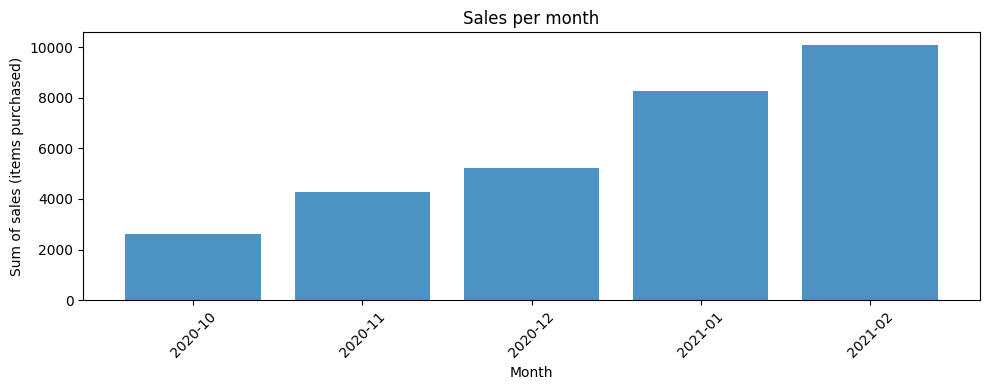
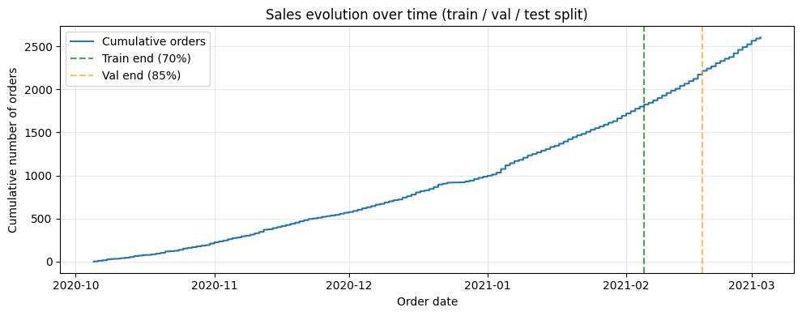
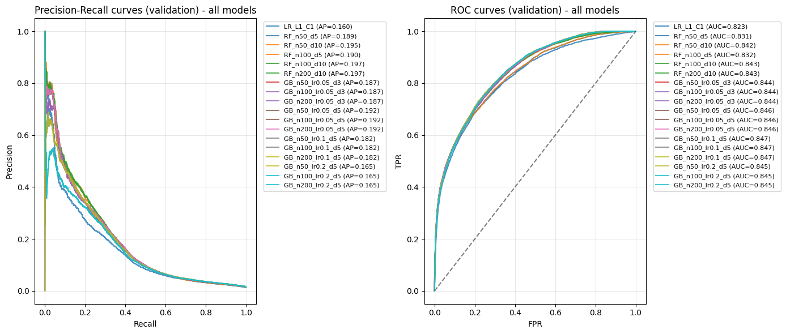

# Predictive model for push notification purchase probability

**Author:** Maria Jorda 
 
**Date:** 14 Mar 2026

This notebook provides the exploration phase for Module 4: building a machine learning model that predicts whether a user will purchase a given product when buying with us. We focus on orders with at least 5 items (sales team requirement).

**Improvements over Module 3:**
- **Time-based split:** Train/validation/test split by cumulative sales (70% / 15% / 15%) instead of by user, since sales have evolved significantly over time, so by splitting by tie we avoid having data leakage.
- **sklearn Pipelines:** Cleaner concatenated preprocessing and modelling.
- **Non-linear models:** Exploration of Random Forest and Gradient Boosting alongside Logistic Regression.
- **Baseline comparison:** Compare all models against baselines (most popular product, majority class).

**Conclusions:**  Random Forest (n_estimators=50, max_depth=5) achieves the highest validation precision (0.79), followed closely by Random Forest (n_estimators=100, max_depth=5) (0.789). We select Random Forest (n_estimators=50, max_depth=5) as the final model to use. Model selection would ideally be aligned with the sales team on what to prioritise; given the TDD, we use precision as the criterion. The pipeline is implemented in `push_train.py` and `push_predict.py`.


```python
import matplotlib.pyplot as plt
import numpy as np
import pandas as pd
from pathlib import Path
from sklearn.ensemble import GradientBoostingClassifier, RandomForestClassifier
from sklearn.linear_model import LogisticRegression
from sklearn.metrics import (
    accuracy_score,
    auc,
    average_precision_score,
    f1_score,
    fbeta_score,
    precision_recall_curve,
    precision_score,
    recall_score,
    roc_curve,
)
from sklearn.pipeline import Pipeline
from sklearn.preprocessing import StandardScaler, TargetEncoder
```

## 1. Data load and pre-step: filter orders with ≥5 purchased products

We filter by `order_id` where the sum of `outcome` ≥ 5 (sales team requirement).


```python
# In order to pull the data you need to have the files in a folder in the same directory as this notebook. 
# If you have the data in a different location, you can change the path in the code below.
RANDOM_STATE = 42
RELATIVE_PATH = "module_4_datasets/"
```


```python
df = pd.read_csv(Path(RELATIVE_PATH) / "feature_frame.csv")
df["created_at"] = pd.to_datetime(df["created_at"])
df["order_date"] = pd.to_datetime(df["order_date"])

# Filter: orders with at least 5 purchased items
purchased_per_order = df.groupby("order_id")["outcome"].sum()
valid_order_ids = purchased_per_order[purchased_per_order >= 5].index
df_filtered = df[df["order_id"].isin(valid_order_ids)].copy()

print(f"Original shape: {df.shape}")
print(f"After filter (≥5 items): {df_filtered.shape}")
```

    Original shape: (2880549, 27)
    After filter (≥5 items): (2163953, 27)


## 2. Time-based train / validation / test split

We split by **time** (not by user) because sales have evolved significantly since the first dates of the dataset. We compute the cumulative sum of sales (order count per date) and split:
- **Train:** first 70% of cumulative sales
- **Validation:** next 15% (70%–85%)
- **Test:** last 15% (85%–100%)


```python
# Plot: sum of sales per month (items purchased per month)
df_filtered["month"] = df_filtered["order_date"].dt.to_period("M")
monthly_sales = df_filtered.groupby("month")["outcome"].sum()
monthly_sales = monthly_sales.iloc[:-1]  # exclude last month (may be incomplete)
fig, ax = plt.subplots(figsize=(10, 4))
monthly_sales.plot(kind="bar", ax=ax, width=0.8, alpha=0.8)
ax.set_xlabel("Month")
ax.set_ylabel("Sum of sales (items purchased)")
ax.set_title("Sales per month")
ax.tick_params(axis="x", rotation=45)
plt.tight_layout()
plt.show()
df_filtered = df_filtered.drop(columns=["month"])
```


    

    


```python
# Get first order_date per order_id (orders may have multiple rows)
order_to_date = df_filtered.groupby("order_id")["order_date"].min()
order_dates_sorted = order_to_date.sort_values()  # Orders in chronological order
n_orders = len(order_dates_sorted)

# Cumulative order count (proxy for cumulative sales) for plotting
cumulative_orders = np.arange(1, n_orders + 1)
train_cutoff = int(0.70 * n_orders)
val_cutoff = int(0.85 * n_orders)

# Plot: sales evolution over time (cumulative order count)
fig, ax = plt.subplots(figsize=(10, 4))
ax.plot(order_dates_sorted.values, cumulative_orders, label="Cumulative orders")
if train_cutoff > 0:
    ax.axvline(order_dates_sorted.iloc[train_cutoff - 1], color="green", linestyle="--", alpha=0.7, label="Train end (70%)")
if val_cutoff > 0 and val_cutoff <= n_orders:
    ax.axvline(order_dates_sorted.iloc[val_cutoff - 1], color="orange", linestyle="--", alpha=0.7, label="Val end (85%)")
ax.set_xlabel("Order date")
ax.set_ylabel("Cumulative number of orders")
ax.set_title("Sales evolution over time (train / val / test split)")
ax.legend()
ax.grid(True, alpha=0.3)
plt.tight_layout()
plt.show()

train_order_ids = set(order_dates_sorted.index[:train_cutoff])
val_order_ids = set(order_dates_sorted.index[train_cutoff:val_cutoff])
test_order_ids = set(order_dates_sorted.index[val_cutoff:])

# Sample for faster exploration (set EXPLORATION_SAMPLE_FRAC=1.0 for full run)
EXPLORATION_SAMPLE_FRAC = 1.0
if EXPLORATION_SAMPLE_FRAC < 1.0:
    rng = np.random.RandomState(RANDOM_STATE)
    train_list = list(train_order_ids)
    val_list = list(val_order_ids)
    n_train_sample = max(1, int(len(train_list) * EXPLORATION_SAMPLE_FRAC))
    n_val_sample = max(1, int(len(val_list) * EXPLORATION_SAMPLE_FRAC))
    train_order_ids = set(rng.choice(train_list, size=n_train_sample, replace=False))
    val_order_ids = set(rng.choice(val_list, size=n_val_sample, replace=False))
    print(f"Sampled for exploration: train={len(train_order_ids)}, val={len(val_order_ids)}")

df_train = df_filtered[df_filtered["order_id"].isin(train_order_ids)].copy()
df_val = df_filtered[df_filtered["order_id"].isin(val_order_ids)].copy()
df_test = df_filtered[df_filtered["order_id"].isin(test_order_ids)].copy()

print(f"Orders: train={len(train_order_ids)}, val={len(val_order_ids)}, test={len(test_order_ids)}")
print(f"Rows:  train={len(df_train):,}, val={len(df_val):,}, test={len(df_test):,}")
```


    

    


    Orders: train=1822, val=390, test=391
    Rows:  train=1,446,691, val=347,239, test=370,023


## 3. Preprocessing and feature setup

We apply the same preprocessing as Module 3: dtype conversions, cap discount_pct, drop multicollinear columns, target-encode product_type and vendor, and scale numeric features. We use **sklearn Pipelines** for a clean concatenated flow.


```python
BOOLEAN_COLUMNS = ["outcome", "ordered_before", "abandoned_before", "active_snoozed", "set_as_regular"]
INTEGER_COLUMNS = [
    "days_since_purchase_variant_id", "days_since_purchase_product_type",
    "count_adults", "count_children", "count_babies", "count_pets", "people_ex_baby",
]
DROP_COLUMNS = ["people_ex_baby", "std_days_to_buy_variant_id", "std_days_to_buy_product_type"]

# Predictor columns (features) used by the model
FEATURE_COLS = [
    "user_order_seq",
    "ordered_before",
    "abandoned_before",
    "active_snoozed",
    "set_as_regular",
    "normalised_price",
    "discount_pct",
    "global_popularity",
    "count_adults",
    "count_children",
    "count_babies",
    "count_pets",
    "days_since_purchase_variant_id",
    "avg_days_to_buy_variant_id",
    "days_since_purchase_product_type",
    "avg_days_to_buy_product_type",
    "product_type_enc",
    "vendor_enc",
]

def prepare_df(df):
    """Apply dtype conversions and column drops."""
    d = df.copy()
    for col in BOOLEAN_COLUMNS:
        if col in d.columns:
            d[col] = d[col].astype("int64")
    for col in INTEGER_COLUMNS:
        if col in d.columns:
            d[col] = d[col].astype("int64")
    d["discount_pct"] = d["discount_pct"].apply(lambda x: 1 if x > 1 else x)
    for col in DROP_COLUMNS:
        if col in d.columns:
            d = d.drop(columns=[col])
    return d

df_train = prepare_df(df_train)
df_val = prepare_df(df_val)
df_test = prepare_df(df_test)
```


```python
# Target encode product_type and vendor (fit on train only) as in Module 3
encoder_product = TargetEncoder(categories="auto", target_type="continuous", smooth="auto", cv=5, random_state=RANDOM_STATE)
encoder_vendor = TargetEncoder(categories="auto", target_type="continuous", smooth="auto", cv=5, random_state=RANDOM_STATE)

df_train["product_type_enc"] = encoder_product.fit_transform(df_train[["product_type"]], df_train["outcome"])
df_val["product_type_enc"] = encoder_product.transform(df_val[["product_type"]])
df_test["product_type_enc"] = encoder_product.transform(df_test[["product_type"]])

df_train["vendor_enc"] = encoder_vendor.fit_transform(df_train[["vendor"]], df_train["outcome"])
df_val["vendor_enc"] = encoder_vendor.transform(df_val[["vendor"]])
df_test["vendor_enc"] = encoder_vendor.transform(df_test[["vendor"]])

FEATURE_COLS = [c for c in FEATURE_COLS if c in df_train.columns]
print("Predictor columns (features):", FEATURE_COLS)
```

    Predictor columns (features): ['user_order_seq', 'ordered_before', 'abandoned_before', 'active_snoozed', 'set_as_regular', 'normalised_price', 'discount_pct', 'global_popularity', 'count_adults', 'count_children', 'count_babies', 'count_pets', 'days_since_purchase_variant_id', 'avg_days_to_buy_variant_id', 'days_since_purchase_product_type', 'avg_days_to_buy_product_type', 'product_type_enc', 'vendor_enc']


```python
# Build X, y and scale (fit on train only)
scaler = StandardScaler()
X_train = df_train[FEATURE_COLS].values
y_train = df_train["outcome"].values

X_val = df_val[FEATURE_COLS].values
y_val = df_val["outcome"].values

X_test = df_test[FEATURE_COLS].values
y_test = df_test["outcome"].values

X_train_scaled = scaler.fit_transform(X_train)
X_val_scaled = scaler.transform(X_val)
X_test_scaled = scaler.transform(X_test)

print(f"Train positive rate: {y_train.mean():.4f}")
```

    Train positive rate: 0.0151


## 4. Baselines definition

We define two baselines to compare against our models:
1. **Majority class:** Always predict 0 (no purchase): the most frequent class.
2. **Most popular product:** For each row, predict 1 if the product_type is among the top-K most purchased (by purchase count), else 0. We use product_type purchase rate from train.


```python
def evaluate(y_true, y_pred, name="Model"):
    """Compute precision, recall, F1, accuracy."""
    return {
        "model": name,
        "precision": precision_score(y_true, y_pred, zero_division=0),
        "recall": recall_score(y_true, y_pred, zero_division=0),
        "f1": f1_score(y_true, y_pred, zero_division=0),
        "accuracy": accuracy_score(y_true, y_pred),
    }

# Baseline 1: Majority class (always predict 0)
y_pred_majority = np.zeros_like(y_test)
baseline_majority = evaluate(y_test, y_pred_majority, "Baseline: Majority (always 0)")
print("Baseline (majority):", baseline_majority)

# Baseline 2: Most popular product (predict 1 if product_type in top by purchase rate)
purchase_rate_by_product = df_train.groupby("product_type")["outcome"].mean()
top_products = purchase_rate_by_product.nlargest(10).index.tolist()
df_test["_is_top_product"] = df_test["product_type"].isin(top_products)
y_pred_popular = (df_test["_is_top_product"].values).astype(int)
baseline_popular = evaluate(y_test, y_pred_popular, "Baseline: Top-10 popular product")
print("Baseline (top-10 popular):", baseline_popular)
```

    Baseline (majority): {'model': 'Baseline: Majority (always 0)', 'precision': 0.0, 'recall': 0.0, 'f1': 0.0, 'accuracy': 0.9869845928496337}
    Baseline (top-10 popular): {'model': 'Baseline: Top-10 popular product', 'precision': 0.024961018216852808, 'recall': 0.40884551495016613, 'f1': 0.04704954658956499, 'accuracy': 0.7844431292108869}


## 5. Model comparison and hyperparameter tuning

We compare:
- **Logistic Regression** (linear baseline)
- **Random Forest** (hyperparameters: n_estimators, max_depth)
- **Gradient Boosting** (hyperparameters: learning_rate, max_depth)

All use a `Pipeline` with `StandardScaler` + classifier. We tune RF and GB to find the best config.


```python
# Hyperparameter grids for tuning
RANDOM_FOREST_PARAMS = [
    {"n_estimators": 50, "max_depth": 5},
    {"n_estimators": 50, "max_depth": 10},
    {"n_estimators": 100, "max_depth": 5},
    {"n_estimators": 100, "max_depth": 10},
    {"n_estimators": 200, "max_depth": 10},
]
GRADIENT_BOOSTING_PARAMS = [
    {"n_estimators": 50, "learning_rate": 0.05, "max_depth": 3},
    {"n_estimators": 100, "learning_rate": 0.05, "max_depth": 3},
    {"n_estimators": 200, "learning_rate": 0.05, "max_depth": 3},   
    {"n_estimators": 50, "learning_rate": 0.05, "max_depth": 5},
    {"n_estimators": 100, "learning_rate": 0.05, "max_depth": 5},
    {"n_estimators": 200, "learning_rate": 0.05, "max_depth": 5},
    {"n_estimators": 50, "learning_rate": 0.1, "max_depth": 5},
    {"n_estimators": 100, "learning_rate": 0.1, "max_depth": 5},
    {"n_estimators": 200, "learning_rate": 0.1, "max_depth": 5},
    {"n_estimators": 50, "learning_rate": 0.2, "max_depth": 5},
    {"n_estimators": 100, "learning_rate": 0.2, "max_depth": 5},
    {"n_estimators": 200, "learning_rate": 0.2, "max_depth": 5},
]

# Build all models: LR + RF variants + GB variants
models_config = [
    ("LR_L1_C1", Pipeline([
        ("scaler", StandardScaler()),
        ("clf", LogisticRegression(l1_ratio=1, C=1.0, solver="saga", max_iter=1000, random_state=RANDOM_STATE)),
    ])),
]
for params in RANDOM_FOREST_PARAMS:
    name = f"RF_n{params['n_estimators']}_d{params['max_depth']}"
    models_config.append((name, Pipeline([
        ("scaler", StandardScaler()),
        ("clf", RandomForestClassifier(n_estimators=params["n_estimators"], max_depth=params["max_depth"], random_state=RANDOM_STATE)),
    ])))
for params in GRADIENT_BOOSTING_PARAMS:
    name = f"GB_n{params['n_estimators']}_lr{params['learning_rate']}_d{params['max_depth']}"
    models_config.append((name, Pipeline([
        ("scaler", StandardScaler()),
        ("clf", GradientBoostingClassifier(n_estimators=100, learning_rate=params["learning_rate"], max_depth=params["max_depth"], random_state=RANDOM_STATE)),
    ])))

results = [baseline_majority, baseline_popular]
for name, pipe in models_config:
    pipe.fit(X_train, y_train)
    y_val_pred = pipe.predict(X_val)
    results.append(evaluate(y_val, y_val_pred, name))

results_df = pd.DataFrame(results).sort_values("precision", ascending=False)
results_df
```

    /Users/mariajordamunoz/Library/Caches/pypoetry/virtualenvs/zrive-ds-Yy3t-uQX-py3.11/lib/python3.11/site-packages/sklearn/linear_model/_logistic.py:1197: UserWarning: l1_ratio parameter is only used when penalty is 'elasticnet'. Got (penalty=l2)
      warnings.warn(


<div>
<style scoped>
    .dataframe tbody tr th:only-of-type {
        vertical-align: middle;
    }

    .dataframe tbody tr th {
        vertical-align: top;
    }

    .dataframe thead th {
        text-align: right;
    }
</style>
<table border="1" class="dataframe">
  <thead>
    <tr style="text-align: right;">
      <th></th>
      <th>model</th>
      <th>precision</th>
      <th>recall</th>
      <th>f1</th>
      <th>accuracy</th>
    </tr>
  </thead>
  <tbody>
    <tr>
      <th>3</th>
      <td>RF_n50_d5</td>
      <td>0.790698</td>
      <td>0.035933</td>
      <td>0.068742</td>
      <td>0.986735</td>
    </tr>
    <tr>
      <th>5</th>
      <td>RF_n100_d5</td>
      <td>0.789474</td>
      <td>0.034876</td>
      <td>0.066802</td>
      <td>0.986724</td>
    </tr>
    <tr>
      <th>6</th>
      <td>RF_n100_d10</td>
      <td>0.758741</td>
      <td>0.045868</td>
      <td>0.086506</td>
      <td>0.986802</td>
    </tr>
    <tr>
      <th>7</th>
      <td>RF_n200_d10</td>
      <td>0.737589</td>
      <td>0.043965</td>
      <td>0.082984</td>
      <td>0.986761</td>
    </tr>
    <tr>
      <th>4</th>
      <td>RF_n50_d10</td>
      <td>0.732639</td>
      <td>0.044599</td>
      <td>0.084080</td>
      <td>0.986761</td>
    </tr>
    <tr>
      <th>10</th>
      <td>GB_n200_lr0.05_d3</td>
      <td>0.701258</td>
      <td>0.047136</td>
      <td>0.088334</td>
      <td>0.986744</td>
    </tr>
    <tr>
      <th>8</th>
      <td>GB_n50_lr0.05_d3</td>
      <td>0.701258</td>
      <td>0.047136</td>
      <td>0.088334</td>
      <td>0.986744</td>
    </tr>
    <tr>
      <th>9</th>
      <td>GB_n100_lr0.05_d3</td>
      <td>0.701258</td>
      <td>0.047136</td>
      <td>0.088334</td>
      <td>0.986744</td>
    </tr>
    <tr>
      <th>11</th>
      <td>GB_n50_lr0.05_d5</td>
      <td>0.660574</td>
      <td>0.053477</td>
      <td>0.098944</td>
      <td>0.986730</td>
    </tr>
    <tr>
      <th>12</th>
      <td>GB_n100_lr0.05_d5</td>
      <td>0.660574</td>
      <td>0.053477</td>
      <td>0.098944</td>
      <td>0.986730</td>
    </tr>
    <tr>
      <th>13</th>
      <td>GB_n200_lr0.05_d5</td>
      <td>0.660574</td>
      <td>0.053477</td>
      <td>0.098944</td>
      <td>0.986730</td>
    </tr>
    <tr>
      <th>16</th>
      <td>GB_n200_lr0.1_d5</td>
      <td>0.558317</td>
      <td>0.061721</td>
      <td>0.111153</td>
      <td>0.986551</td>
    </tr>
    <tr>
      <th>14</th>
      <td>GB_n50_lr0.1_d5</td>
      <td>0.558317</td>
      <td>0.061721</td>
      <td>0.111153</td>
      <td>0.986551</td>
    </tr>
    <tr>
      <th>15</th>
      <td>GB_n100_lr0.1_d5</td>
      <td>0.558317</td>
      <td>0.061721</td>
      <td>0.111153</td>
      <td>0.986551</td>
    </tr>
    <tr>
      <th>18</th>
      <td>GB_n100_lr0.2_d5</td>
      <td>0.449296</td>
      <td>0.067428</td>
      <td>0.117258</td>
      <td>0.986168</td>
    </tr>
    <tr>
      <th>17</th>
      <td>GB_n50_lr0.2_d5</td>
      <td>0.449296</td>
      <td>0.067428</td>
      <td>0.117258</td>
      <td>0.986168</td>
    </tr>
    <tr>
      <th>19</th>
      <td>GB_n200_lr0.2_d5</td>
      <td>0.449296</td>
      <td>0.067428</td>
      <td>0.117258</td>
      <td>0.986168</td>
    </tr>
    <tr>
      <th>2</th>
      <td>LR_L1_C1</td>
      <td>0.425926</td>
      <td>0.068062</td>
      <td>0.117368</td>
      <td>0.986053</td>
    </tr>
    <tr>
      <th>1</th>
      <td>Baseline: Top-10 popular product</td>
      <td>0.024961</td>
      <td>0.408846</td>
      <td>0.047050</td>
      <td>0.784443</td>
    </tr>
    <tr>
      <th>0</th>
      <td>Baseline: Majority (always 0)</td>
      <td>0.000000</td>
      <td>0.000000</td>
      <td>0.000000</td>
      <td>0.986985</td>
    </tr>
  </tbody>
</table>
</div>


Choosing the "best" model is not straightforward: precision, recall, and F1 trade off (e.g. RF models have higher precision but lower recall than GB models). In a real rollout we would align with the sales team to decide what to prioritize. Given the TDD (push notifications should minimise false positives), we rank by validation precision. With the full dataset, **RF_n50_d5** (n_estimators=50, max_depth=5) achieves the highest precision (0.79) and is selected as the default model.

### Precision-Recall and ROC curves (on validation set)

All ML models (LR + RF + GB variants) are overlapped on the same axes to compare performance. Baselines are excluded to avoid adding more noise.


```python
# Overlay: all ML models (exclude baselines) on Precision-Recall and ROC curves
ml_models = [(n, p) for n, p in models_config]
colors = plt.cm.tab10(np.linspace(0, 1, len(ml_models)))

fig, axes = plt.subplots(1, 2, figsize=(14, 6))

for (name, pipe), color in zip(ml_models, colors):
    y_val_proba = pipe.predict_proba(X_val)[:, 1]
    prec_vals, rec_vals, _ = precision_recall_curve(y_val, y_val_proba)
    fpr, tpr, _ = roc_curve(y_val, y_val_proba)
    roc_auc_val = auc(fpr, tpr)
    ap = average_precision_score(y_val, y_val_proba)
    axes[0].plot(rec_vals, prec_vals, color=color, label=f"{name} (AP={ap:.3f})", alpha=0.8)
    axes[1].plot(fpr, tpr, color=color, label=f"{name} (AUC={roc_auc_val:.3f})", alpha=0.8)

axes[0].set_xlabel("Recall")
axes[0].set_ylabel("Precision")
axes[0].set_title("Precision-Recall curves (validation) - all models")
axes[0].legend(bbox_to_anchor=(1.02, 1), loc="upper left", fontsize=8)
axes[0].grid(True, alpha=0.3)

axes[1].plot([0, 1], [0, 1], "k--", alpha=0.5)
axes[1].set_xlabel("FPR")
axes[1].set_ylabel("TPR")
axes[1].set_title("ROC curves (validation) - all models")
axes[1].legend(bbox_to_anchor=(1.02, 1), loc="upper left", fontsize=8)
axes[1].grid(True, alpha=0.3)
plt.tight_layout()
plt.show()

# Best model by validation precision
ml_results = results_df[~results_df["model"].str.startswith("Baseline")]
best_name = ml_results.iloc[0]["model"]
best_pipe = next(p for n, p in ml_models if n == best_name)
print(f"Best model (by validation precision): {best_name}")
```


    

    


    Best model (by validation precision): RF_n50_d5


The ROC curves are very similar across all ML models (AUC clustered around 0.82–0.85), and the Precision-Recall curves also show a similar shape. This suggests that, in terms of discriminative power, the models are comparable. It is noteworthy that the model with fewer trees (RF_n50_d5) achieves the highest precision, outperforming configurations with more trees (e.g. RF_n100_d5, RF_n200_d10). This may indicate that simpler Random Forests generalise better for this task, possibly due to less overfitting.


```python
# Evaluate best model on test set (best_name, best_pipe from previous cell)
y_test_pred = best_pipe.predict(X_test)
test_metrics = evaluate(y_test, y_test_pred, best_name)
print(f"Best model: {best_name}")
print(f"Test metrics: {test_metrics}")
```

    Best model: RF_n50_d5
    Test metrics: {'model': 'RF_n50_d5', 'precision': 0.8646288209606987, 'recall': 0.04111295681063123, 'f1': 0.07849355797819624, 'accuracy': 0.9874359161457531}


So the chosen model is **RF_n50_d5** (Random Forest, n_estimators=50, max_depth=5), with validation precision 0.79 on the full dataset. We would ideally align with the sales team to decide what to prioritise; given the TDD (push notifications should minimise false positives), we use precision as the selection criterion. The pipeline is implemented in `push_train.py` and `push_predict.py` for deployment.


