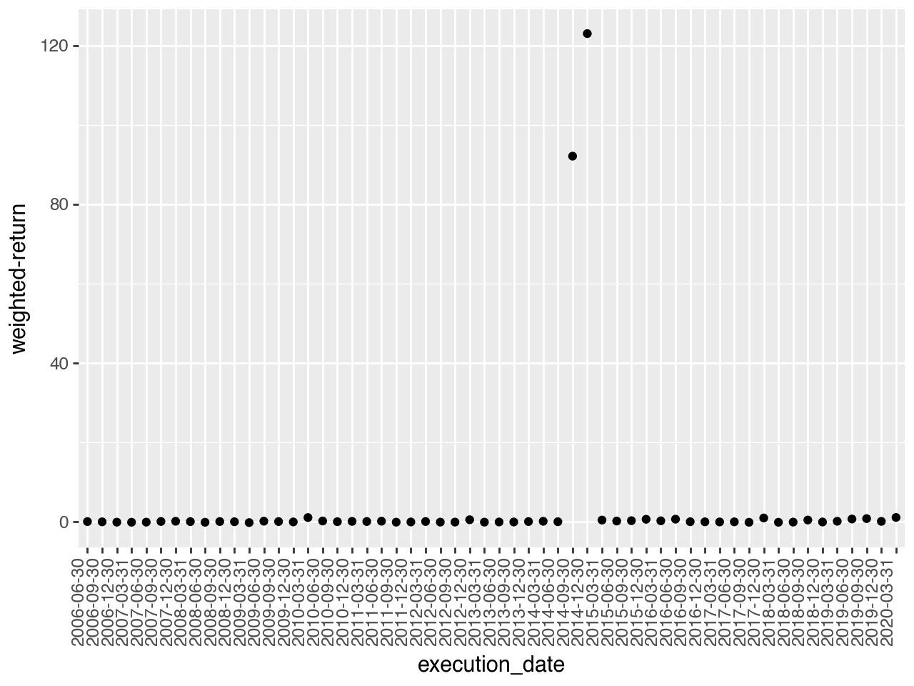
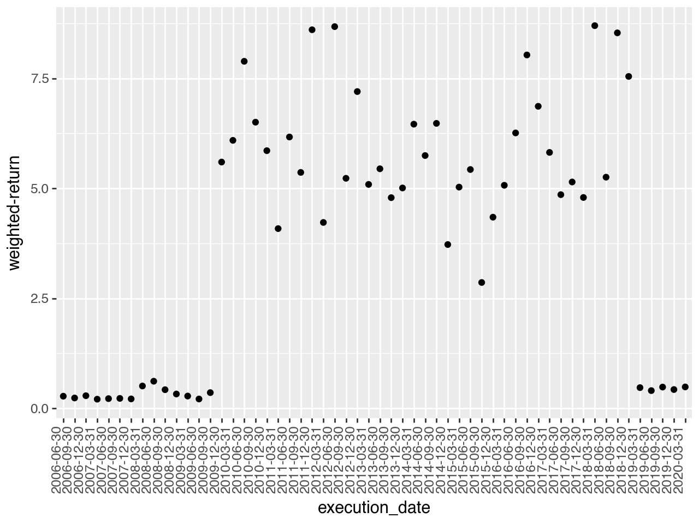
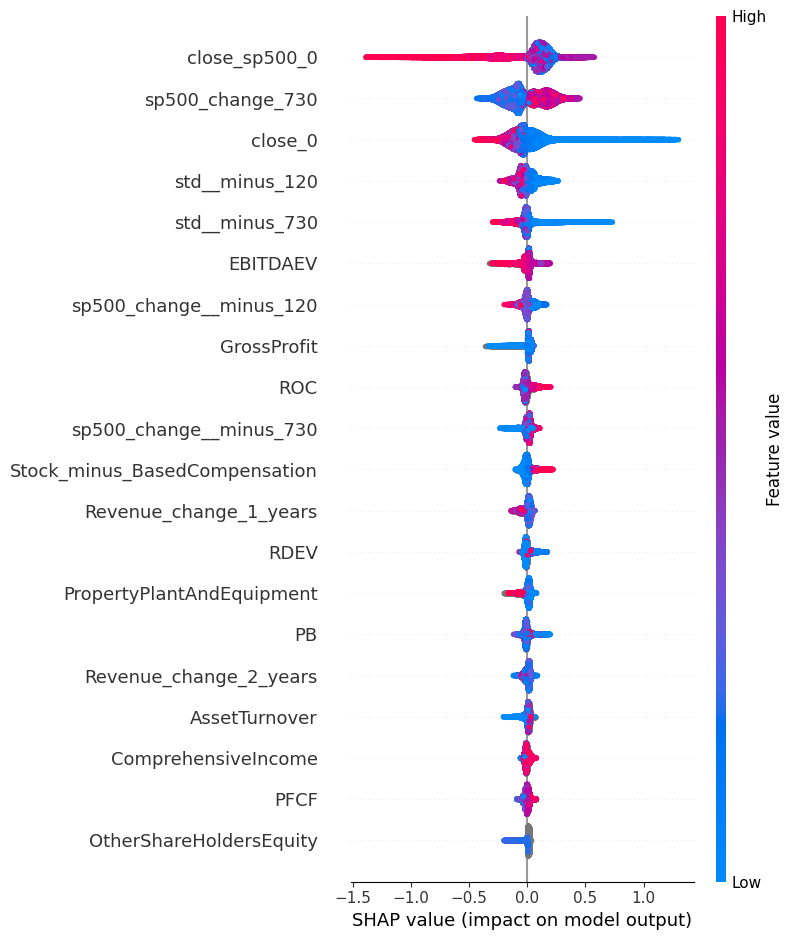
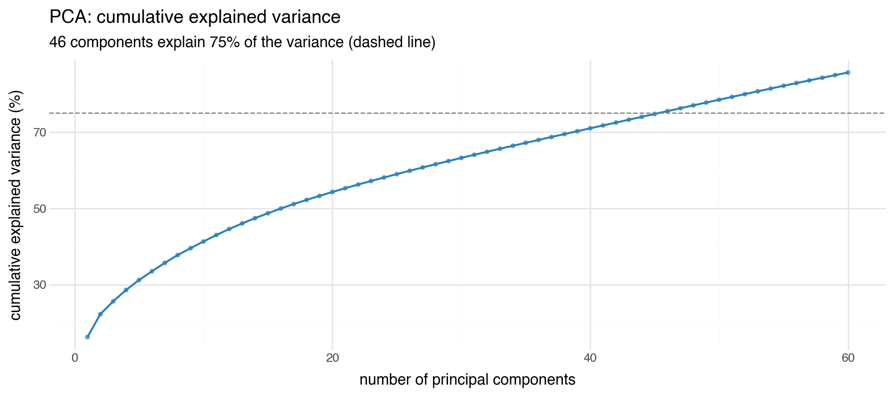
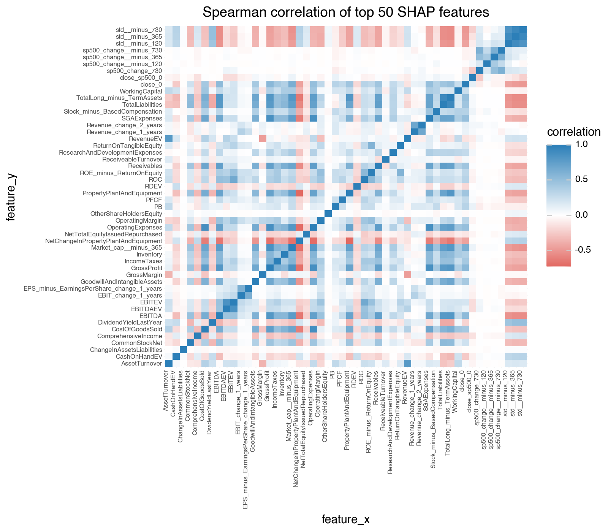
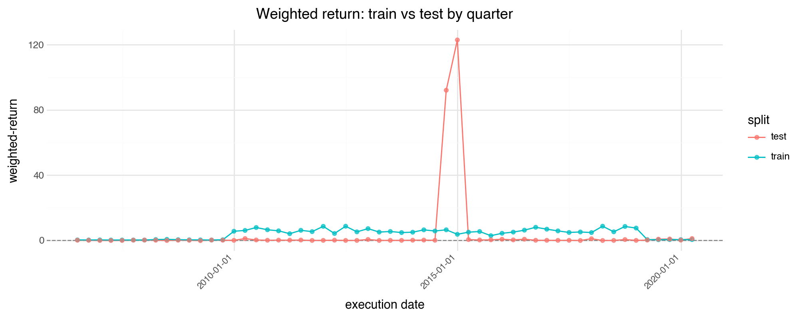
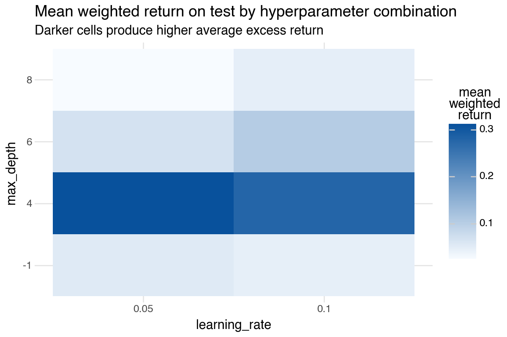
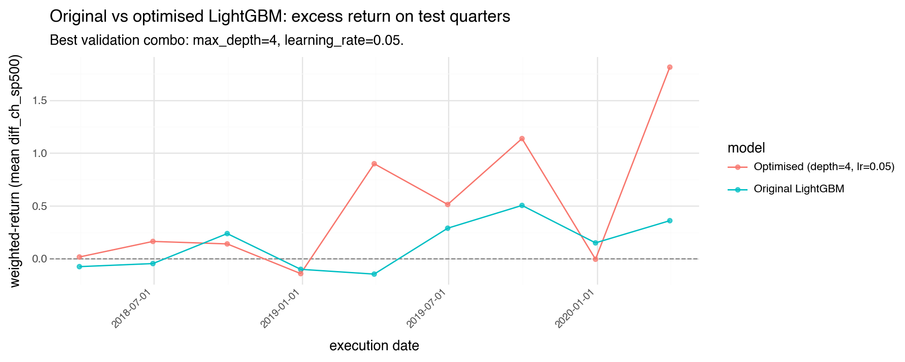

## Module 5: Analyse, diagnose and improve a model​

In the excercise of this week you will be working with financial data in order to (hopefully) find a portfolio of equities which outperform SP500. The data that you are gonna work with has two main sources: 
* Financial data from the companies extracted from the quarterly company reports (mostly extracted from [macrotrends](https://www.macrotrends.net/) so you can use this website to understand better the data and get insights on the features, for example [this](https://www.macrotrends.net/stocks/charts/AAPL/apple/revenue) is the one corresponding to APPLE)
* Stock prices, mostly extracted from [morningstar](https://indexes.morningstar.com/page/morningstar-indexes-empowering-investor-success?utm_source=google&utm_medium=cpc&utm_campaign=MORNI%3AG%3ASearch%3ABrand%3ACore%3AUK%20MORNI%3ABrand%3ACore%3ABroad&utm_content=engine%3Agoogle%7Ccampaignid%3A18471962329%7Cadid%3A625249340069&utm_term=morningstar%20index&gclid=CjwKCAjws9ipBhB1EiwAccEi1Fu6i20XHVcxFxuSEtJGF0If-kq5-uKnZ3rov3eRkXXFfI5j8QBtBBoCayEQAvD_BwE), which basically tell us how the stock price is evolving so we can use it both as past features and the target to predict).

Before going to the problem that we want to solve, let's comment some of the columns of the dataset:


* `Ticker`: a [short name](https://en.wikipedia.org/wiki/Ticker_symbol) to identify the equity (that you can use to search in macrotrends)
* `date`: the date of the company report (normally we are gonna have 1 every quarter). This is for informative purposes but you can ignore it when modeling.
* `execution date`: the date when we would had executed the algorithm for that equity. We want to execute the algorithm once per quarter to create the portfolio, but the release `date`s of all the different company reports don't always match for the quarter, so we just take a common `execution_date` for all of them.
* `stock_change_div_365`: what is the % change of the stock price (with dividens) in the FOLLOWING year after `execution date`. 
* `sp500_change_365`: what is the % change of the SP500 in the FOLLOWING year after `execution date`.
* `close_0`: what is the price at the moment of `execution date`
* `stock_change__minus_120` what is the % change of the stock price in the last 120 days
* `stock_change__minus_730`: what is the % change of the stock price in the last 730 days

The rest of the features can be divided beteween financial features (the ones coming from the reports) and technical features (coming from the stock price). We leave the technical features here as a reference: 


```python
technical_features = ['close_0', 'close_sp500_0', 'close_365', 'close_sp500_365',
       'close__minus_120', 'close_sp500__minus_120', 'close__minus_365',
       'close_sp500__minus_365', 'close__minus_730', 'close_sp500__minus_730',
       'stock_change_365','stock_change_div_365', 'sp500_change_365', 'stock_change__minus_120',
       'sp500_change__minus_120', 'stock_change__minus_365',
       'sp500_change__minus_365', 'stock_change__minus_730','sp500_change__minus_730',
       'std__minus_365','std__minus_730','std__minus_120']
```

The problem that we want to solve is basically find a portfolio of `top_n` tickers (initially set to 10) to invest every `execution date` (basically once per quarter) and the goal is to have a better return than `SP500` in the following year. The initial way to model this is to have a binary target which is 1 when `stock_change_div_365` - `sp500_change_365` (the difference between the return of the equity and the SP500 in the following year) is positive or 0 otherwise. So we try to predict the probability of an equity of improving SP500 in the following year, we take the `top_n` equities and compute their final return.


```python
import pandas as pd
import numpy as np
import lightgbm as lgb
from plotnine import ggplot, aes, geom_col, coord_flip,scale_x_discrete, geom_point, theme, theme_minimal, element_text, labs
```


```python
# number of trees in lightgbm
n_trees = 40
minimum_number_of_tickers = 1500
# Number of the quarters in the past to train
n_train_quarters = 36
# number of tickers to make the portfolio
top_n = 10
```


```python
data_set = pd.read_feather("data/financials_against_return.feather")
```

Remove these quarters which have les than `minimum_number_of_tickers` tickers:


```python
df_quarter_lengths = data_set.groupby(["execution_date"]).size().reset_index().rename(columns = {0:"count"})
data_set = pd.merge(data_set, df_quarter_lengths, on = ["execution_date"])
data_set = data_set[data_set["count"]>=minimum_number_of_tickers]
```


```python
data_set.shape
```


    (170483, 145)


Create the target:


```python
data_set["diff_ch_sp500"] = data_set["stock_change_div_365"] - data_set["sp500_change_365"]

data_set.loc[data_set["diff_ch_sp500"]>0,"target"] = 1
data_set.loc[data_set["diff_ch_sp500"]<0,"target"] = 0

data_set["target"].value_counts()
```


    target
    0.0    82437
    1.0    73829
    Name: count, dtype: int64


This function computes the main metric that we want to optimize: given a prediction where we have probabilities for each equity, we sort the equities in descending order of probability, we pick the `top_n` ones, and we we weight the returned `diff_ch_sp500` by the probability:


```python
def get_weighted_performance_of_stocks(df,metric):
    df["norm_prob"] = 1/len(df)
    return np.sum(df["norm_prob"]*df[metric])

def get_top_tickers_per_prob(preds):
    if len(preds) == len(train_set):
        data_set = train_set.copy()
    elif len(preds) == len(test_set):
        data_set = test_set.copy()
    else:
        assert ("Not matching train/test")
    data_set["prob"] = preds
    data_set = data_set.sort_values(["prob"], ascending = False)
    data_set = data_set.head(top_n)
    return data_set

# main metric to evaluate: average diff_ch_sp500 of the top_n stocks
def top_wt_performance(preds, train_data):
    top_dataset = get_top_tickers_per_prob(preds)
    return "weighted-return", get_weighted_performance_of_stocks(top_dataset,"diff_ch_sp500"), True
```

We have created for you a function to make the `train` and `test` split based on a `execution_date`:


```python
def split_train_test_by_period(data_set, test_execution_date,include_nulls_in_test = False):
    # we train with everything happening at least one year before the test execution date
    train_set = data_set.loc[data_set["execution_date"] <= pd.to_datetime(test_execution_date) - pd.Timedelta(350, unit = "day")]
    # remove those rows where the target is null
    train_set = train_set[~pd.isna(train_set["diff_ch_sp500"])]
    execution_dates = train_set.sort_values("execution_date")["execution_date"].unique()
    # Pick only the last n_train_quarters
    if n_train_quarters!=None:
        train_set = train_set[train_set["execution_date"].isin(execution_dates[-n_train_quarters:])]
        
    # the test set are the rows happening in the execution date with the concrete frequency
    test_set = data_set.loc[(data_set["execution_date"] == test_execution_date)]
    if not include_nulls_in_test:
        test_set = test_set[~pd.isna(test_set["diff_ch_sp500"])]
    test_set = test_set.sort_values('date', ascending = False).drop_duplicates('Ticker', keep = 'first')
    
    return train_set, test_set
```

Ensure that we don't include features which are irrelevant or related to the target:


```python
def get_columns_to_remove():
    columns_to_remove = [
                         "date",
                         "improve_sp500",
                         "Ticker",
                         "freq",
                         "set",
                         "close_sp500_365",
                         "close_365",
                         "stock_change_365",
                         "sp500_change_365",
                         "stock_change_div_365",
                         "stock_change_730",
                         "sp500_change_365",
                         "stock_change_div_730",
                         "diff_ch_sp500",
                         "diff_ch_avg_500",
                         "execution_date","target","index","quarter","std_730","count"]
        
    return columns_to_remove
```

This is the main modeling function, it receives a train test and a test set and trains a `lightgbm` in classification mode. We don't recommend to change the main algorithm for this excercise but we suggest to play with its hyperparameters:


```python
import warnings
warnings.filterwarnings('ignore')


def train_model(train_set,test_set,n_estimators = 300):

    columns_to_remove = get_columns_to_remove()
    
    X_train = train_set.drop(columns = columns_to_remove, errors = "ignore")
    X_test = test_set.drop(columns = columns_to_remove, errors = "ignore")
    
    
    y_train = train_set["target"]
    y_test = test_set["target"]

    lgb_train = lgb.Dataset(X_train,y_train)
    lgb_test = lgb.Dataset(X_test, y_test, reference=lgb_train)
    
    eval_result = {}
    
 
    objective = 'binary'
    metric = 'binary_logloss' 
    params = {
             "random_state":1, 
             "verbosity": -1,
             "n_jobs":10, 
             "n_estimators":n_estimators,
             "objective": objective,
             "metric": metric}
    
    model = lgb.train(params = params,train_set = lgb_train,
                      valid_sets = [lgb_test,lgb_train],
                      feval = [top_wt_performance],
                      callbacks = [lgb.record_evaluation(eval_result = eval_result)])
    return model,eval_result,X_train,X_test


 
            
```

This is the function which receives an `execution_date` and splits the dataset between train and test, trains the models and evaluates the model in test. It returns a dictionary with the different evaluation metrics in train and test:


```python
def run_model_for_execution_date(execution_date,all_results,all_predicted_tickers_list,all_models,n_estimators,include_nulls_in_test = False):
        global train_set
        global test_set
        # split the dataset between train and test
        train_set, test_set = split_train_test_by_period(data_set,execution_date,include_nulls_in_test = include_nulls_in_test)
        train_size, _ = train_set.shape
        test_size, _ = test_set.shape
        model = None
        X_train = None
        X_test = None
        
        # if both train and test are not empty
        if train_size > 0 and test_size>0:
            model, evals_result, X_train, X_test = train_model(train_set,
                                                              test_set,
                                                              n_estimators = n_estimators)
            
            test_set['prob'] = model.predict(X_test)
            predicted_tickers = test_set.sort_values('prob', ascending = False)
            predicted_tickers["execution_date"] = execution_date
            all_results[(execution_date)] = evals_result
            all_models[(execution_date)] = model
            all_predicted_tickers_list.append(predicted_tickers)
        return all_results,all_predicted_tickers_list,all_models,model,X_train,X_test


execution_dates = np.sort( data_set['execution_date'].unique() )

```

This is the main training loop: it goes through each different `execution_date` and calls `run_model_for_execution_date`. All the results are stored in `all_results` and the predictions in `all_predicted_tickers_list`.


```python
all_results = {}
all_predicted_tickers_list = []
all_models = {}

for execution_date in execution_dates:
    print(execution_date)
    all_results,all_predicted_tickers_list,all_models,model,X_train,X_test = run_model_for_execution_date(execution_date,all_results,all_predicted_tickers_list,all_models,n_trees,False)
all_predicted_tickers = pd.concat(all_predicted_tickers_list) 
```

    2005-06-30T00:00:00.000000000
    2005-09-30T00:00:00.000000000
    2005-12-30T00:00:00.000000000
    2006-03-31T00:00:00.000000000
    2006-06-30T00:00:00.000000000
    2006-09-30T00:00:00.000000000
    2006-12-30T00:00:00.000000000
    2007-03-31T00:00:00.000000000
    2007-06-30T00:00:00.000000000
    2007-09-30T00:00:00.000000000
    2007-12-30T00:00:00.000000000
    2008-03-31T00:00:00.000000000
    2008-06-30T00:00:00.000000000
    2008-09-30T00:00:00.000000000
    2008-12-30T00:00:00.000000000
    2009-03-31T00:00:00.000000000
    2009-06-30T00:00:00.000000000
    2009-09-30T00:00:00.000000000
    2009-12-30T00:00:00.000000000
    2010-03-31T00:00:00.000000000
    2010-06-30T00:00:00.000000000
    2010-09-30T00:00:00.000000000
    2010-12-30T00:00:00.000000000
    2011-03-31T00:00:00.000000000
    2011-06-30T00:00:00.000000000
    2011-09-30T00:00:00.000000000
    2011-12-30T00:00:00.000000000
    2012-03-31T00:00:00.000000000
    2012-06-30T00:00:00.000000000
    2012-09-30T00:00:00.000000000
    2012-12-30T00:00:00.000000000
    2013-03-31T00:00:00.000000000
    2013-06-30T00:00:00.000000000
    2013-09-30T00:00:00.000000000
    2013-12-30T00:00:00.000000000
    2014-03-31T00:00:00.000000000
    2014-06-30T00:00:00.000000000
    2014-09-30T00:00:00.000000000
    2014-12-30T00:00:00.000000000
    2015-03-31T00:00:00.000000000
    2015-06-30T00:00:00.000000000
    2015-09-30T00:00:00.000000000
    2015-12-30T00:00:00.000000000
    2016-03-31T00:00:00.000000000
    2016-06-30T00:00:00.000000000
    2016-09-30T00:00:00.000000000
    2016-12-30T00:00:00.000000000
    2017-03-31T00:00:00.000000000
    2017-06-30T00:00:00.000000000
    2017-09-30T00:00:00.000000000
    2017-12-30T00:00:00.000000000
    2018-03-31T00:00:00.000000000
    2018-06-30T00:00:00.000000000
    2018-09-30T00:00:00.000000000
    2018-12-30T00:00:00.000000000
    2019-03-31T00:00:00.000000000
    2019-06-30T00:00:00.000000000
    2019-09-30T00:00:00.000000000
    2019-12-30T00:00:00.000000000
    2020-03-31T00:00:00.000000000
    2020-06-30T00:00:00.000000000
    2020-09-30T00:00:00.000000000
    2020-12-30T00:00:00.000000000
    2021-03-27T00:00:00.000000000


```python
def parse_results_into_df(set_):
    df = pd.DataFrame()
    for date in all_results:
        df_tmp = pd.DataFrame(all_results[(date)][set_])
        df_tmp["n_trees"] = list(range(len(df_tmp)))
        df_tmp["execution_date"] = date
        df= pd.concat([df,df_tmp])
    
    df["execution_date"] = df["execution_date"].astype(str)
    
    return df
```


```python
test_results = parse_results_into_df("valid_0")
train_results = parse_results_into_df("training")
```


```python
test_results_final_tree = test_results.sort_values(["execution_date","n_trees"]).drop_duplicates("execution_date",keep = "last")
train_results_final_tree = train_results.sort_values(["execution_date","n_trees"]).drop_duplicates("execution_date",keep = "last")

```

And this are the results:


```python
ggplot(test_results_final_tree) + geom_point(aes(x = "execution_date", y = "weighted-return")) + theme(axis_text_x = element_text(angle = 90, vjust = 0.5, hjust=1))


```


    

    


```python
ggplot(train_results_final_tree) + geom_point(aes(x = "execution_date", y = "weighted-return")) + theme(axis_text_x = element_text(angle = 90, vjust = 0.5, hjust=1))

```


    

    


We have trained the first models for all the periods for you, but there are a lot of things which may be wrong or can be improved. Some ideas where you can start:
* Try to see if there is any kind of data leakage or suspicious features
* If the training part is very slow, try to see how you can modify it to execute faster tests
* Try to understand if the algorithm is learning correctly
* We are using a very high level metric to evaluate the algorithm so you maybe need to use some more low level ones
* Try to see if there is overfitting
* Try to see if there is a lot of noise between different trainings
* To simplify, why if you only keep the first tickers in terms of Market Cap?
* Change the number of quarters to train in the past

This function can be useful to compute the feature importance:


```python
def draw_feature_importance(model,top = 15):
    fi = model.feature_importance()
    fn = model.feature_name()
    feature_importance = pd.DataFrame([{"feature":fn[i],"imp":fi[i]} for i in range(len(fi))])
    feature_importance = feature_importance.sort_values("imp",ascending = False).head(top)
    feature_importance = feature_importance.sort_values("imp",ascending = True)
    plot = ggplot(feature_importance,aes(x = "feature",y  = "imp")) + geom_col(fill = "lightblue") + coord_flip() +  scale_x_discrete(limits = feature_importance["feature"])
    return plot

```


```python
from scipy.stats import lognorm
import matplotlib.pyplot as plt
```

## Module 5: extra analysis

The main notebook above trains a LightGBM model once per quarter (walk forward) and saves results in objects like `all_results`, `all_models`, and `test_results_final_tree`.

Everything below reuses what its already defined: `split_train_test_by_period`, `get_columns_to_remove`, `get_weighted_performance_of_stocks`, and the same `data_set` and hyperparameters (`n_trees`, `top_n`, `n_train_quarters`). 


### 1) Feature inventory

Before trusting any model we look at the inputs. Each row is a stock at some time and the columns are the numeric features we pass to LightGBM after dropping ids, targets, and other fields that are not model features.


```python
cols = get_columns_to_remove()
_X_demo = data_set.drop(columns=cols, errors="ignore")
rows = []
for c in _X_demo.columns:
    s = _X_demo[c]
    rows.append({
        "feature": c,
        "dtype": str(s.dtype),
        "missing_pct": float(s.isna().mean() * 100),
        "n_unique": int(s.nunique(dropna=True)),
    })
feature_manifest_df = pd.DataFrame(rows).sort_values("feature")
feature_manifest_df.head(20)

```


<div>
<style scoped>
    .dataframe tbody tr th:only-of-type {
        vertical-align: middle;
    }

    .dataframe tbody tr th {
        vertical-align: top;
    }

    .dataframe thead th {
        text-align: right;
    }
</style>
<table border="1" class="dataframe">
  <thead>
    <tr style="text-align: right;">
      <th></th>
      <th>feature</th>
      <th>dtype</th>
      <th>missing_pct</th>
      <th>n_unique</th>
    </tr>
  </thead>
  <tbody>
    <tr>
      <th>0</th>
      <td>AssetTurnover</td>
      <td>float64</td>
      <td>4.172850</td>
      <td>10541</td>
    </tr>
    <tr>
      <th>1</th>
      <td>CashFlowFromFinancialActivities</td>
      <td>float64</td>
      <td>1.137943</td>
      <td>95195</td>
    </tr>
    <tr>
      <th>2</th>
      <td>CashFlowFromInvestingActivities</td>
      <td>float64</td>
      <td>1.132078</td>
      <td>90068</td>
    </tr>
    <tr>
      <th>3</th>
      <td>CashFlowFromOperatingActivities</td>
      <td>float64</td>
      <td>0.707402</td>
      <td>99331</td>
    </tr>
    <tr>
      <th>4</th>
      <td>CashOnHand</td>
      <td>float64</td>
      <td>1.757360</td>
      <td>123532</td>
    </tr>
    <tr>
      <th>108</th>
      <td>CashOnHandEV</td>
      <td>float64</td>
      <td>1.848865</td>
      <td>167319</td>
    </tr>
    <tr>
      <th>5</th>
      <td>ChangeInAccountsPayable</td>
      <td>float64</td>
      <td>12.415901</td>
      <td>40142</td>
    </tr>
    <tr>
      <th>6</th>
      <td>ChangeInAccountsReceivable</td>
      <td>float64</td>
      <td>5.868034</td>
      <td>59929</td>
    </tr>
    <tr>
      <th>7</th>
      <td>ChangeInAssetsLiabilities</td>
      <td>float64</td>
      <td>3.222022</td>
      <td>58231</td>
    </tr>
    <tr>
      <th>8</th>
      <td>ChangeInInventories</td>
      <td>float64</td>
      <td>12.952611</td>
      <td>39302</td>
    </tr>
    <tr>
      <th>9</th>
      <td>CommonStockDividendsPaid</td>
      <td>float64</td>
      <td>12.738514</td>
      <td>34144</td>
    </tr>
    <tr>
      <th>10</th>
      <td>CommonStockNet</td>
      <td>float64</td>
      <td>4.966478</td>
      <td>43354</td>
    </tr>
    <tr>
      <th>11</th>
      <td>ComprehensiveIncome</td>
      <td>float64</td>
      <td>25.123326</td>
      <td>63573</td>
    </tr>
    <tr>
      <th>12</th>
      <td>CostOfGoodsSold</td>
      <td>float64</td>
      <td>10.107753</td>
      <td>107167</td>
    </tr>
    <tr>
      <th>13</th>
      <td>CurrentRatio</td>
      <td>float64</td>
      <td>22.010406</td>
      <td>53696</td>
    </tr>
    <tr>
      <th>130</th>
      <td>CurrentRatio_change_1_years</td>
      <td>float64</td>
      <td>28.653883</td>
      <td>119763</td>
    </tr>
    <tr>
      <th>131</th>
      <td>CurrentRatio_change_2_years</td>
      <td>float64</td>
      <td>35.057454</td>
      <td>108994</td>
    </tr>
    <tr>
      <th>14</th>
      <td>DaysSalesInReceivables</td>
      <td>float64</td>
      <td>25.997900</td>
      <td>116577</td>
    </tr>
    <tr>
      <th>16</th>
      <td>DebtEquityRatio</td>
      <td>float64</td>
      <td>17.466258</td>
      <td>38266</td>
    </tr>
    <tr>
      <th>15</th>
      <td>DebtIssuanceRetirementNet_minus_Total</td>
      <td>float64</td>
      <td>5.719045</td>
      <td>69448</td>
    </tr>
  </tbody>
</table>
</div>


```python
feature_manifest_df.shape
```


    (134, 4)


### 2) SHAP feature importance

SHAP explains how much each feature pushes the model output up or down for each row. Here we take the last trained LightGBM model in `all_models`, build SHAP values on its training rows, and average the absolute value per feature so we can see which variables matter most overall.

The bar chart shows the top 20 features ranked by mean absolute SHAP value. The beeswarm plot adds the direction: red means the feature pushes the prediction towards 1 (the stock outperforms), blue means the opposite. Each dot is one observation.


```python
import shap

_last_ed = sorted(all_models.keys())[-1]
_model = all_models[_last_ed]
_tr, _te = split_train_test_by_period(data_set, _last_ed)
cols = get_columns_to_remove()
_Xtr = _tr.drop(columns=cols, errors="ignore")
Xs = _Xtr 
explainer = shap.TreeExplainer(_model)
sv = explainer.shap_values(Xs)
if isinstance(sv, list):
    sv = sv[1] if len(sv) > 1 else sv[0]
mean_abs = np.abs(sv).mean(axis=0)
shap_importance_df = pd.DataFrame({"feature": list(Xs.columns), "mean_abs_shap": mean_abs}).sort_values(
    "mean_abs_shap", ascending=False
)
TOP3_FEATURES = shap_importance_df["feature"].head(3).tolist()
_shap_vals = sv
print("Last execution_date:", _last_ed)
print("Top 3 (mean |SHAP|):", TOP3_FEATURES)
shap_importance_df.head(15)

```

    Last execution_date: 2020-03-31T00:00:00.000000000
    Top 3 (mean |SHAP|): ['close_sp500_0', 'sp500_change_730', 'close_0']


<div>
<style scoped>
    .dataframe tbody tr th:only-of-type {
        vertical-align: middle;
    }

    .dataframe tbody tr th {
        vertical-align: top;
    }

    .dataframe thead th {
        text-align: right;
    }
</style>
<table border="1" class="dataframe">
  <thead>
    <tr style="text-align: right;">
      <th></th>
      <th>feature</th>
      <th>mean_abs_shap</th>
    </tr>
  </thead>
  <tbody>
    <tr>
      <th>88</th>
      <td>close_sp500_0</td>
      <td>0.184412</td>
    </tr>
    <tr>
      <th>89</th>
      <td>sp500_change_730</td>
      <td>0.134647</td>
    </tr>
    <tr>
      <th>87</th>
      <td>close_0</td>
      <td>0.110893</td>
    </tr>
    <tr>
      <th>99</th>
      <td>std__minus_120</td>
      <td>0.059833</td>
    </tr>
    <tr>
      <th>101</th>
      <td>std__minus_730</td>
      <td>0.055217</td>
    </tr>
    <tr>
      <th>105</th>
      <td>EBITDAEV</td>
      <td>0.032363</td>
    </tr>
    <tr>
      <th>92</th>
      <td>sp500_change__minus_120</td>
      <td>0.032163</td>
    </tr>
    <tr>
      <th>24</th>
      <td>GrossProfit</td>
      <td>0.030055</td>
    </tr>
    <tr>
      <th>114</th>
      <td>ROC</td>
      <td>0.027983</td>
    </tr>
    <tr>
      <th>98</th>
      <td>sp500_change__minus_730</td>
      <td>0.025657</td>
    </tr>
    <tr>
      <th>74</th>
      <td>Stock_minus_BasedCompensation</td>
      <td>0.025451</td>
    </tr>
    <tr>
      <th>126</th>
      <td>Revenue_change_1_years</td>
      <td>0.025087</td>
    </tr>
    <tr>
      <th>112</th>
      <td>RDEV</td>
      <td>0.022754</td>
    </tr>
    <tr>
      <th>62</th>
      <td>PropertyPlantAndEquipment</td>
      <td>0.022482</td>
    </tr>
    <tr>
      <th>111</th>
      <td>PB</td>
      <td>0.019168</td>
    </tr>
  </tbody>
</table>
</div>


We now plot the beeswarm plot.


```python
shap.summary_plot(_shap_vals, _Xtr, show=True)

```


    

    


The top five features split into two groups. The first two are market-level signals. `close_sp500_0`, the current index level, pushes predicted probability down when it is high. That could reflect mean reversion or expensive-market dynamics. `sp500_change_730`, the two-year past return of the S&P 500, pushes predictions up when it is high, which is somewhat surprising, since a market that has risen sharply sets a higher bar for individual stocks to beat. One candidate explanation is a cycle effect (broad markets tend to coincide with wide breadth), but this is a pattern to monitor for stability across periods.

The remaining three are stock-level signals. `close_0`, the nominal stock price, shows a long right tail for low-price names. Nominal price is arbitrary and heavily influenced by market cap and splits, so this likely captures size or liquidity effects rather than cheapness. `std__minus_120` and `std__minus_730` both penalize high volatility: calmer past price paths are associated with higher predicted probability. That aligns with a quality or low-beta story.

The overall picture is that the model leans heavily on macro regime and price-level features over company fundamentals. Many accounting variables (`EBITDAEV`, `GrossProfit`, `ROC`) appear in the bottom half. That is worth keeping in mind when we look at PCA and redundancy: the leading principal components may capture market-wide variation rather than cross-sectional fundamental differences.

### 3) Feature redundancy: PCA, correlation and VIF

Having many features is not always better. When features carry similar information the model may overfit to noise or spread importance across correlated copies of the same signal. This section looks at three angles: principal component analysis to see how many independent dimensions there really are, a Spearman correlation matrix to spot the most entangled pairs, and variance inflation factors as a linear redundancy score per feature.


First, PCA is fitted on the training set of the last execution date. This is a diagnostic exercise to understand how many independent dimensions the feature space contains. We impute missing values with the column median before scaling. The median is preferred over the mean for financial data because distributions tend to be skewed and heavy-tailed. This imputation is only used here to make PCA feasible on a complete matrix. It is not applied to the features the LightGBM models see during training, which handles missing values natively through its split logic.


```python
from sklearn.preprocessing import StandardScaler
from sklearn.decomposition import PCA
from plotnine import geom_line, geom_hline

_tr_pca, _ = split_train_test_by_period(data_set, sorted(all_models.keys())[-1])
_cols_rm = get_columns_to_remove()
_Xpca = _tr_pca.drop(columns=_cols_rm, errors="ignore").select_dtypes(include=[np.number])
_Xpca = _Xpca.replace([np.inf, -np.inf], np.nan)   
_Xpca = _Xpca.fillna(_Xpca.median())               
_Xpca = _Xpca.dropna(axis=1)                      

scaler = StandardScaler()
X_scaled = scaler.fit_transform(_Xpca)

pca = PCA().fit(X_scaled)
cumvar = np.cumsum(pca.explained_variance_ratio_) * 100

n_components_75 = int(np.searchsorted(cumvar, 75)) + 1
print(f"Features in the model: {_Xpca.shape[1]}")
print(f"Components needed to explain 75% of variance: {n_components_75}")

pca_df = pd.DataFrame({
    "n_components": np.arange(1, len(cumvar) + 1),
    "cumulative_variance_pct": cumvar,
})

(
    ggplot(pca_df.head(60), aes("n_components", "cumulative_variance_pct"))
    + geom_line(color="#2c7fb8", size=0.8)
    + geom_point(size=1.0, color="#2c7fb8", alpha=0.6)
    + geom_hline(yintercept=75, linetype="dashed", color="gray")
    + theme_minimal()
    + labs(
        title="PCA: cumulative explained variance",
        subtitle=f"{n_components_75} components explain 75% of the variance (dashed line)",
        x="number of principal components",
        y="cumulative explained variance (%)",
    )
    + theme(figure_size=(9, 4))
)

```

    Features in the model: 133
    Components needed to explain 75% of variance: 46


    

    


The feature space is not strongly compressible. 46 components are needed to explain just 75% of variance across 133 features, and the curve shows no clean elbow where adding more components stops helping. This suggests the features capture diverse and relatively independent signals rather than redundant copies of the same information. For feature reduction, a SHAP-based approach (keeping the top N original features by mean absolute SHAP) is more principled than PCA projection here, because it preserves interpretability and does not require refitting a new preprocessing step per fold. However, SHAP importance alone is not enough to decide which features to drop: two features can both have high importance and still be highly correlated, meaning the model uses both but one could be redundant. Before deciding on a cutoff, we look at the Spearman correlation matrix and variance inflation factors in the next section. The idea is to identify groups of correlated features and, within each group, keep the one with the highest SHAP score. 


```python
from statsmodels.stats.outliers_influence import variance_inflation_factor

# Use top SHAP features for both correlation and VIF
top50_shap_features = shap_importance_df["feature"].head(50).tolist()

_tr, _ = split_train_test_by_period(data_set, sorted(all_models.keys())[-1])
cols = get_columns_to_remove()
_Xtr = _tr.drop(columns=cols, errors="ignore")

# Keep only top SHAP features that exist in the data
top50_available = [f for f in top50_shap_features if f in _Xtr.columns]
num = _Xtr[top50_available].select_dtypes(include=[np.number])
num = num.replace([np.inf, -np.inf], np.nan)
num = num.fillna(num.median())

corr_mat = num.corr(method="spearman")

# VIF on the same features with the same imputation
Z = num.values
vif_rows = []
for i, c in enumerate(num.columns):
    vif_rows.append({"feature": c, "VIF": float(variance_inflation_factor(Z, i))})
vif_df = pd.DataFrame(vif_rows).sort_values("VIF", ascending=False)
vif_df
```


<div>
<style scoped>
    .dataframe tbody tr th:only-of-type {
        vertical-align: middle;
    }

    .dataframe tbody tr th {
        vertical-align: top;
    }

    .dataframe thead th {
        text-align: right;
    }
</style>
<table border="1" class="dataframe">
  <thead>
    <tr style="text-align: right;">
      <th></th>
      <th>feature</th>
      <th>VIF</th>
    </tr>
  </thead>
  <tbody>
    <tr>
      <th>46</th>
      <td>OperatingExpenses</td>
      <td>163.870673</td>
    </tr>
    <tr>
      <th>35</th>
      <td>CostOfGoodsSold</td>
      <td>121.664900</td>
    </tr>
    <tr>
      <th>7</th>
      <td>GrossProfit</td>
      <td>17.172704</td>
    </tr>
    <tr>
      <th>47</th>
      <td>TotalLong_minus_TermAssets</td>
      <td>14.605367</td>
    </tr>
    <tr>
      <th>25</th>
      <td>TotalLiabilities</td>
      <td>9.775524</td>
    </tr>
    <tr>
      <th>40</th>
      <td>EBITDA</td>
      <td>7.340702</td>
    </tr>
    <tr>
      <th>23</th>
      <td>SGAExpenses</td>
      <td>6.274097</td>
    </tr>
    <tr>
      <th>45</th>
      <td>Market_cap__minus_365</td>
      <td>5.649485</td>
    </tr>
    <tr>
      <th>13</th>
      <td>PropertyPlantAndEquipment</td>
      <td>3.408136</td>
    </tr>
    <tr>
      <th>28</th>
      <td>WorkingCapital</td>
      <td>3.230532</td>
    </tr>
    <tr>
      <th>27</th>
      <td>Inventory</td>
      <td>3.205930</td>
    </tr>
    <tr>
      <th>20</th>
      <td>ResearchAndDevelopmentExpenses</td>
      <td>2.152452</td>
    </tr>
    <tr>
      <th>38</th>
      <td>GoodwillAndIntangibleAssets</td>
      <td>1.993512</td>
    </tr>
    <tr>
      <th>10</th>
      <td>Stock_minus_BasedCompensation</td>
      <td>1.943364</td>
    </tr>
    <tr>
      <th>30</th>
      <td>NetChangeInPropertyPlantAndEquipment</td>
      <td>1.802945</td>
    </tr>
    <tr>
      <th>32</th>
      <td>IncomeTaxes</td>
      <td>1.649698</td>
    </tr>
    <tr>
      <th>49</th>
      <td>ROE_minus_ReturnOnEquity</td>
      <td>1.633234</td>
    </tr>
    <tr>
      <th>16</th>
      <td>AssetTurnover</td>
      <td>1.548416</td>
    </tr>
    <tr>
      <th>41</th>
      <td>Receivables</td>
      <td>1.547056</td>
    </tr>
    <tr>
      <th>31</th>
      <td>CommonStockNet</td>
      <td>1.379917</td>
    </tr>
    <tr>
      <th>17</th>
      <td>ComprehensiveIncome</td>
      <td>1.348329</td>
    </tr>
    <tr>
      <th>42</th>
      <td>ReturnOnTangibleEquity</td>
      <td>1.303725</td>
    </tr>
    <tr>
      <th>24</th>
      <td>NetTotalEquityIssuedRepurchased</td>
      <td>1.269934</td>
    </tr>
    <tr>
      <th>19</th>
      <td>OtherShareHoldersEquity</td>
      <td>1.032984</td>
    </tr>
    <tr>
      <th>29</th>
      <td>RevenueEV</td>
      <td>1.010327</td>
    </tr>
    <tr>
      <th>8</th>
      <td>ROC</td>
      <td>1.006885</td>
    </tr>
    <tr>
      <th>2</th>
      <td>close_0</td>
      <td>1.006202</td>
    </tr>
    <tr>
      <th>44</th>
      <td>ChangeInAssetsLiabilities</td>
      <td>1.005381</td>
    </tr>
    <tr>
      <th>12</th>
      <td>RDEV</td>
      <td>1.004496</td>
    </tr>
    <tr>
      <th>34</th>
      <td>OperatingMargin</td>
      <td>1.004356</td>
    </tr>
    <tr>
      <th>22</th>
      <td>GrossMargin</td>
      <td>1.003622</td>
    </tr>
    <tr>
      <th>39</th>
      <td>EBITEV</td>
      <td>1.001834</td>
    </tr>
    <tr>
      <th>18</th>
      <td>PFCF</td>
      <td>1.001181</td>
    </tr>
    <tr>
      <th>5</th>
      <td>EBITDAEV</td>
      <td>1.000944</td>
    </tr>
    <tr>
      <th>14</th>
      <td>PB</td>
      <td>1.000432</td>
    </tr>
    <tr>
      <th>15</th>
      <td>Revenue_change_2_years</td>
      <td>1.000384</td>
    </tr>
    <tr>
      <th>43</th>
      <td>EPS_minus_EarningsPerShare_change_1_years</td>
      <td>1.000023</td>
    </tr>
    <tr>
      <th>11</th>
      <td>Revenue_change_1_years</td>
      <td>1.000022</td>
    </tr>
    <tr>
      <th>48</th>
      <td>CashOnHandEV</td>
      <td>1.000004</td>
    </tr>
    <tr>
      <th>37</th>
      <td>EBIT_change_1_years</td>
      <td>0.999997</td>
    </tr>
    <tr>
      <th>36</th>
      <td>ReceiveableTurnover</td>
      <td>0.999924</td>
    </tr>
    <tr>
      <th>33</th>
      <td>DividendYieldLastYear</td>
      <td>0.998947</td>
    </tr>
    <tr>
      <th>6</th>
      <td>sp500_change__minus_120</td>
      <td>0.985803</td>
    </tr>
    <tr>
      <th>9</th>
      <td>sp500_change__minus_730</td>
      <td>0.976361</td>
    </tr>
    <tr>
      <th>21</th>
      <td>sp500_change__minus_365</td>
      <td>0.905827</td>
    </tr>
    <tr>
      <th>3</th>
      <td>std__minus_120</td>
      <td>0.894587</td>
    </tr>
    <tr>
      <th>26</th>
      <td>std__minus_365</td>
      <td>0.866632</td>
    </tr>
    <tr>
      <th>4</th>
      <td>std__minus_730</td>
      <td>0.824437</td>
    </tr>
    <tr>
      <th>1</th>
      <td>sp500_change_730</td>
      <td>0.662445</td>
    </tr>
    <tr>
      <th>0</th>
      <td>close_sp500_0</td>
      <td>0.076827</td>
    </tr>
  </tbody>
</table>
</div>


We see really high values of VIF for some variables. `OperatingExpenses` (163) and `CostOfGoodsSold` (121), which makes sense because these are tied together by an accounting identity: GrossProfit = Revenue − COGS and OperatingExpenses typically equals COGS + other operating costs. This means OperatingExpenses is almost a perfect linear combination of CostOfGoodsSold. A VIF of 163 means 99.4% of OperatingExpenses variance is explained by the other features in the set (R² = 1 − 1/VIF). Also, `TotalLong_minus_TermAssets` (14) and `TotalLiabilities` (9.7) are balance sheet items connected by the fundamental accounting identity: Total Assets = Total Liabilities + Equity. Long-term assets and total liabilities are correlated through this identity and through the natural correlation between firm size proxies. Any large company will have high values on both.


```python
from plotnine import geom_tile, scale_fill_gradient2

top_feats = shap_importance_df["feature"].head(50).tolist()
top_feats = [f for f in top_feats if f in corr_mat.columns]
corr_sub = corr_mat.loc[top_feats, top_feats]
corr_long = corr_sub.reset_index().melt(id_vars="index")
corr_long.columns = ["feature_x", "feature_y", "correlation"]

(
    ggplot(corr_long, aes("feature_x", "feature_y", fill="correlation"))
    + geom_tile()
    + scale_fill_gradient2(low="#d73027", mid="white", high="#2c7fb8", midpoint=0)
    + theme_minimal()
    + labs(
        title="Spearman correlation of top 50 SHAP features",
        x=None,
        y=None,
    )
    + theme(
        axis_text_x=element_text(angle=90, hjust=1, size=6),
        axis_text_y=element_text(size=6),
        figure_size=(8, 7),
    )
)

```


    

    


Correlation matrix can seem too big, so we are going to use its info, combined with the VIF results, in the following way:

Step 1: VIF filter: we remove features iteratively: at each iteration, find the feature with the highest VIF above the threshold (values of VIF higher than 10 are considered of high multicollinearity), drop it, recalculate VIF on the remaining set, repeat until no feature exceeds the threshold. We always drop the feature with the highest VIF first; if there is a tie we prefer to drop the one with lower SHAP importance.

Step 2: Correlation filter: for every pair of remaining features with Spearman correlation above 0.85 in absolute value, drop the one with lower SHAP importance. This catches cases where two features are highly correlated but VIF did not flag them strongly because they are not collinear with the rest of the set.

The result is a reduced set of features that are both relevant (ranked by SHAP) and non-redundant (low pairwise correlation, low VIF). This set can then be used to retrain LightGBM and compare weighted return against the baseline.


```python
from statsmodels.stats.outliers_influence import variance_inflation_factor
import numpy as np

VIF_THRESHOLD = 10
CORR_THRESHOLD = 0.85

# Top 50 SHAP features available in the training data
top50 = shap_importance_df["feature"].head(50).tolist()
top50_available = [f for f in top50 if f in _Xtr.columns]

num50 = _Xtr[top50_available].select_dtypes(include=[np.number])
num50 = num50.replace([np.inf, -np.inf], np.nan)
num50 = num50.fillna(num50.median())
num50 = num50.dropna(axis=1)

# SHAP rank lookup (lower index = more important)
shap_rank = {f: i for i, f in enumerate(shap_importance_df["feature"])}

# Step 1: iterative VIF filter
features_vif = list(num50.columns)
removed_vif = []
while True:
    Z = num50[features_vif].values
    vifs = {c: variance_inflation_factor(Z, i) for i, c in enumerate(features_vif)}
    max_feat = max(vifs, key=vifs.get)
    if vifs[max_feat] <= VIF_THRESHOLD:
        break
    features_vif.remove(max_feat)
    removed_vif.append((max_feat, round(vifs[max_feat], 1)))

print(f"Removed by VIF ({len(removed_vif)} features):", removed_vif)
print(f"Remaining after VIF filter: {len(features_vif)}")

# Step 2: correlation filter
corr_mat50 = num50[features_vif].corr(method="spearman")
to_drop_corr = set()
feats = list(corr_mat50.columns)
for i in range(len(feats)):
    for j in range(i + 1, len(feats)):
        if feats[j] in to_drop_corr:
            continue
        if abs(corr_mat50.loc[feats[i], feats[j]]) >= CORR_THRESHOLD:
            worse = feats[i] if shap_rank.get(feats[i], 999) > shap_rank.get(feats[j], 999) else feats[j]
            to_drop_corr.add(worse)

final_features = [f for f in feats if f not in to_drop_corr]
print(f"\nRemoved by correlation ({len(to_drop_corr)} features):", sorted(to_drop_corr))
print(f"\nFinal feature set ({len(final_features)} features):")
for f in sorted(final_features, key=lambda x: shap_rank.get(x, 999)):
    print(f"  {shap_rank.get(f, '?'):>3}  {f}")
```

    Removed by VIF (2 features): [('OperatingExpenses', np.float64(163.9)), ('TotalLong_minus_TermAssets', np.float64(14.4))]
    Remaining after VIF filter: 48
    
    Removed by correlation (4 features): ['EBITEV', 'Market_cap__minus_365', 'SGAExpenses', 'std__minus_365']
    
    Final feature set (44 features):
        0  close_sp500_0
        1  sp500_change_730
        2  close_0
        3  std__minus_120
        4  std__minus_730
        5  EBITDAEV
        6  sp500_change__minus_120
        7  GrossProfit
        8  ROC
        9  sp500_change__minus_730
       10  Stock_minus_BasedCompensation
       11  Revenue_change_1_years
       12  RDEV
       13  PropertyPlantAndEquipment
       14  PB
       15  Revenue_change_2_years
       16  AssetTurnover
       17  ComprehensiveIncome
       18  PFCF
       19  OtherShareHoldersEquity
       20  ResearchAndDevelopmentExpenses
       21  sp500_change__minus_365
       22  GrossMargin
       24  NetTotalEquityIssuedRepurchased
       25  TotalLiabilities
       27  Inventory
       28  WorkingCapital
       29  RevenueEV
       30  NetChangeInPropertyPlantAndEquipment
       31  CommonStockNet
       32  IncomeTaxes
       33  DividendYieldLastYear
       34  OperatingMargin
       35  CostOfGoodsSold
       36  ReceiveableTurnover
       37  EBIT_change_1_years
       38  GoodwillAndIntangibleAssets
       40  EBITDA
       41  Receivables
       42  ReturnOnTangibleEquity
       43  EPS_minus_EarningsPerShare_change_1_years
       44  ChangeInAssetsLiabilities
       48  CashOnHandEV
       49  ROE_minus_ReturnOnEquity


### 4) What we measure (business view)

Before moving forward, we should be aware of the metrics we actually care about when we say the model is good or bad:

**Weighted return** is the main KPI: sort stocks by predicted probability, take the top `top_n`, and average `diff_ch_sp500` with equal weight inside that bucket. That is how much extra return versus the S&P 500 we get on the chosen names.

**AUC** and **log loss** describe how well the model separates class 0 and 1. Useful, but they are not the same as making money on the portfolio rule above.

**Spearman** between predicted probability and `diff_ch_sp500` on the test set: do higher scores go with higher realized excess return?

**Hit rate** by quarter: in how many quarters does the long-only portfolio beat the benchmark in the sense we defined (positive average excess in the top bucket), which is a proxy for consistency over time.


### 5) Overfitting check: train versus test gaps

For each quarter we already stored LightGBM training and validation curves in `all_results`. Here we look at the last boosting iteration only: log loss and weighted return on the training set versus the validation set.

If training error is much better than validation error, or training weighted return looks great while validation does not, that is a sign the model is memorizing noise. This block summarizes those gaps and then plots them over time so you can see whether the gap is stable or growing.


```python
gap_rows = []
for ed, ev in all_results.items():
    ll_tr = ev["training"]["binary_logloss"][-1]
    ll_te = ev["valid_0"]["binary_logloss"][-1]
    wr_tr = ev["training"]["weighted-return"][-1]
    wr_te = ev["valid_0"]["weighted-return"][-1]
    gap_rows.append(
        {
            "execution_date": ed,
            "logloss_gap_train_minus_test": ll_tr - ll_te,
            "weighted_return_train": wr_tr,
            "weighted_return_test": wr_te,
        }
    )
gap_df = pd.DataFrame(gap_rows)
gap_df.describe()

```


<div>
<style scoped>
    .dataframe tbody tr th:only-of-type {
        vertical-align: middle;
    }

    .dataframe tbody tr th {
        vertical-align: top;
    }

    .dataframe thead th {
        text-align: right;
    }
</style>
<table border="1" class="dataframe">
  <thead>
    <tr style="text-align: right;">
      <th></th>
      <th>execution_date</th>
      <th>logloss_gap_train_minus_test</th>
      <th>weighted_return_train</th>
      <th>weighted_return_test</th>
    </tr>
  </thead>
  <tbody>
    <tr>
      <th>count</th>
      <td>56</td>
      <td>56.000000</td>
      <td>56.000000</td>
      <td>56.000000</td>
    </tr>
    <tr>
      <th>mean</th>
      <td>2013-05-15 12:51:25.714285824</td>
      <td>-0.123041</td>
      <td>4.026900</td>
      <td>4.029023</td>
    </tr>
    <tr>
      <th>min</th>
      <td>2006-06-30 00:00:00</td>
      <td>-0.482813</td>
      <td>0.209679</td>
      <td>-0.156777</td>
    </tr>
    <tr>
      <th>25%</th>
      <td>2009-12-07 06:00:00</td>
      <td>-0.143455</td>
      <td>0.461359</td>
      <td>-0.003614</td>
    </tr>
    <tr>
      <th>50%</th>
      <td>2013-05-15 12:00:00</td>
      <td>-0.100189</td>
      <td>5.020313</td>
      <td>0.104718</td>
    </tr>
    <tr>
      <th>75%</th>
      <td>2016-10-22 18:00:00</td>
      <td>-0.070596</td>
      <td>6.111982</td>
      <td>0.256594</td>
    </tr>
    <tr>
      <th>max</th>
      <td>2020-03-31 00:00:00</td>
      <td>0.023960</td>
      <td>8.699668</td>
      <td>122.997449</td>
    </tr>
    <tr>
      <th>std</th>
      <td>NaN</td>
      <td>0.090245</td>
      <td>2.906764</td>
      <td>20.322250</td>
    </tr>
  </tbody>
</table>
</div>


```python
gap_df["execution_date"] = pd.to_datetime(gap_df["execution_date"])
gap_plot = gap_df[["execution_date", "weighted_return_train", "weighted_return_test"]].melt(
    id_vars="execution_date",
    value_vars=["weighted_return_train", "weighted_return_test"],
    var_name="split",
    value_name="weighted_return",
)
gap_plot["split"] = gap_plot["split"].str.replace("weighted_return_", "", regex=False)

(
    ggplot(gap_plot, aes("execution_date", "weighted_return", color="split"))
    + geom_hline(yintercept=0, linetype="dashed", color="gray")
    + geom_line(size=0.6)
    + geom_point(size=1.5, alpha=0.7)
    + theme_minimal()
    + labs(
        title="Weighted return: train vs test by quarter",
        x="execution date",
        y="weighted-return",
    )
    + theme(
        axis_text_x=element_text(angle=45, hjust=1, size=8),
        figure_size=(10, 4),
    )
)
```


    

    


The logloss gap (train minus test) has a mean of -0.123, meaning train logloss is consistently lower than test logloss. That is the expected direction, since the model always fits its training data better, and the magnitude is modest and stable across quarters (std = 0.09), so there is no alarming sign of extreme overfitting from a classification perspective.

The weighted return picture tells a different story. The means in the table look almost identical (train 4.03, test 4.03) but that comparison is entirely driven by a single outlier: one test quarter around 2014-2015 where the portfolio achieved a weighted return close to 123. Looking at the medians instead, we see that the train median is around 5.0 while test median is around 0.10. That is the real picture. The model consistently delivers strong portfolio returns on the quarters it trains on, but barely beats zero at the median on quarters it has never seen.

The spike around 2014-2015 is worth noting separately. A single exceptional quarter where the top ten picks massively outperformed the index can distort every aggregate statistic. It could reflect a genuine market anomaly, a data quality issue, or survivorship bias in the dataset for that period. Results should be interpreted with that outlier in mind.

The overall conclusion from this section is that there is a clear sign of overfitting: in-sample weighted return is solid and stable, while out-of-sample performance is noisy and near zero at the median. The model is learning patterns specific to its training quarters rather than generalising to new ones. This is the main motivation for the hyperparameter tuning section that follows, where we try to regularise the model with lower max depth and smaller learning rate to close this gap.


But before moving to the next section, we are going to explore the spike at the end of 2014, in order to understand what could have happened.


```python
peak_date = gap_df.loc[gap_df["weighted_return_test"].idxmax(), "execution_date"]
peak_tickers = all_predicted_tickers[
    all_predicted_tickers["execution_date"] == peak_date
]
print(peak_date)
print(peak_tickers[["Ticker", "diff_ch_sp500", "prob"]].sort_values("diff_ch_sp500", ascending=False))
```

    2014-12-30 00:00:00
          Ticker  diff_ch_sp500      prob
    89604   TYME    1217.859738  0.585048
    89946   NUZE      19.008167  0.483014
    88358   NYMX       8.057330  0.676290
    88185   AVXL       5.883167  0.570075
    88974   EGRX       5.291970  0.304872
    ...      ...            ...       ...
    88973    GNK      -0.883371  0.300876
    88032   NXTD      -0.883478  0.240502
    88214   USEG      -0.888156  0.261771
    90175   AEYE      -0.895206  0.257181
    88549   CPST      -0.905649  0.209613
    
    [2759 rows x 3 columns]


We see that the peak was driven by TYME, which is the Ticker that corresponds to Tyme Technologies.


```python
tyme_rows = data_set[data_set["Ticker"] == "TYME"].sort_values("execution_date")
print(tyme_rows[["execution_date", "close_0", "stock_change_div_365", "sp500_change_365", "diff_ch_sp500"]].to_string())
```

           execution_date    close_0  stock_change_div_365  sp500_change_365  diff_ch_sp500
    69500      2013-03-31   0.009231              0.000000          0.198545      -0.198545
    72051      2013-06-30   0.009231              0.000000          0.213794      -0.213794
    74544      2013-09-30   0.009231             -0.000068          0.172899      -0.172967
    77177      2013-12-30   0.009231             -0.000068          0.129965      -0.130033
    79708      2014-03-31   0.009231            746.511500          0.104443     746.407057
    82395      2014-06-30   0.009231            919.847500          0.052484     919.795016
    84063      2014-06-30   0.009231            919.847500          0.052484     919.795016
    86188      2014-09-30   0.009230            919.910076         -0.026496     919.936572
    85104      2014-09-30   0.009230            919.910076         -0.026496     919.936572
    87853      2014-12-30   0.009230           1217.851571         -0.008167    1217.859738
    89604      2014-12-30   0.009230           1217.851571         -0.008167    1217.859738
    90569      2015-03-31   6.900000             -0.108696         -0.001906      -0.106790
    91994      2015-03-31   6.900000             -0.108696         -0.001906      -0.106790
    93378      2015-06-30   8.500000             -0.117647          0.003713      -0.121360
    95131      2015-06-30   8.500000             -0.117647          0.003713      -0.121360
    97638      2015-09-30   8.500000             -0.547059          0.120365      -0.667424
    101116     2015-12-30  11.250000             -0.728889          0.090097      -0.818986
    104107     2016-03-31   6.050000             -0.523967          0.147095      -0.671062
    105494     2016-06-30   6.100000             -0.508197          0.154634      -0.662830
    109606     2016-09-30   3.500000              0.508571          0.161920       0.346651
    111169     2016-12-30   3.750000              0.701333          0.194202       0.507132
    115952     2017-03-31   2.880000             -0.225694          0.117724      -0.343418
    118219     2017-06-30   3.000000              0.053333          0.121715      -0.068381
    122166     2017-09-30   5.280000             -0.486742          0.160847      -0.647589
    123911     2017-12-30   6.380000             -0.421630         -0.062374      -0.359256
    128960     2018-03-31   2.230000             -0.152466          0.085702      -0.238169
    131280     2018-06-30   3.160000             -0.626582          0.090480      -0.717063
    133062     2018-09-30   2.710000             -0.560886          0.017830      -0.578716
    137659     2018-12-30   3.690000             -0.677507          0.284997      -0.962504
    140083     2019-03-31   1.890000             -0.439153         -0.083897      -0.355257
    145380     2019-06-30   1.180000              0.169492          0.029992       0.139500
    148846     2019-09-30   1.190000             -0.208319          0.120514      -0.328833
    152536     2019-12-30   1.190000             -0.084034          0.157002      -0.241035
    154716     2020-03-31   1.100000              0.636364          0.537782       0.098582
    157379     2020-06-30   1.330000                   NaN               NaN            NaN
    163102     2020-09-30   0.980000                   NaN               NaN            NaN
    164710     2020-12-30   1.150000                   NaN               NaN            NaN
    169620     2021-03-27   1.800000                   NaN               NaN            NaN


We see that the price of the stock was close to 0 before 2015, and then it raises to 7-11$ in 2015. I have looked for TYME stock price in the internet and what we see here was exactly what happened. So we don't have a data quality issue, but it is not a signal the model could exploit either, because at $0.009 per share the stock was essentially illiquid because no investor could have purchased a meaningful position at that price, so the return is theoretical rather than achievable. Also, the event driving the return was a corporate restructuring, not an improvement in the fundamental financial ratios that the model uses as features. 

So this is a structural limitation of the dataset. Small and micro-cap stocks that undergo reverse mergers or relisting events can generate extreme one-year returns that are unforeseeable from balance sheet and price momentum features. A production system should apply a market capitalisation or liquidity filter to exclude names trading below a minimum price or volume threshold, which would remove this observation and produce a more realistic picture of model performance.


```python
MIN_PRICE = 1.0

filtered_wr_rows = []
for ed, grp in all_predicted_tickers.groupby("execution_date"):
    grp_clean = grp[grp["close_0"] >= MIN_PRICE].head(top_n).copy()
    if len(grp_clean) == 0:
        continue
    wr = get_weighted_performance_of_stocks(grp_clean, "diff_ch_sp500")
    filtered_wr_rows.append({"execution_date": ed, "weighted_return_filtered": wr})

filtered_df = pd.DataFrame(filtered_wr_rows)
filtered_df["execution_date"] = pd.to_datetime(filtered_df["execution_date"])

orig = test_results_final_tree[["execution_date", "weighted-return"]].copy()
orig["execution_date"] = pd.to_datetime(orig["execution_date"])
compare = orig.merge(filtered_df, on="execution_date")
print(compare[["weighted-return", "weighted_return_filtered"]].describe())
```

           weighted-return  weighted_return_filtered
    count        56.000000                 56.000000
    mean          4.029023                  0.088524
    std          20.322250                  0.171858
    min          -0.156777                 -0.156777
    25%          -0.003614                 -0.021658
    50%           0.104718                  0.059853
    75%           0.256594                  0.142320
    max         122.997449                  0.924583


So we see that after filtering low-priced stocks, the mean drops from 4.03 to 0.09, the std drops from 20.32 to 0.17, the median falls to 0.06 and the max falls from 123 to 0.92.

Results are now consistent across quarters rather than dominated by a single outlier event and the model delivers close to zero excess return on test quarters.

Let's try to improve the baseline model by doing some hyperparameter tuning.

### 6) Hyperparameter tuning

We sweep two parameters that have the most impact on LightGBM complexity: `max_depth` and `learning_rate`. To avoid overfitting on the test set, we first split all execution dates into three non-overlapping temporal blocks: the first 60% are used for model training within each walk-forward fold, the next 20% form the validation set where we compare hyperparameter combinations, and the final 20% are held out as the test set.

For each combination of max_depth and learning_rate we retrain using the walk-forward logic on the validation dates and record weighted return and log loss. The price filter of close_0 >= $1 is applied throughout to exclude uninvestable stocks. 

`max_depth` controls how deep each tree can grow. The default in LightGBM is -1 (no limit), with complexity mostly bounded by `num_leaves`. Lower depths regularize the model and can reduce overfitting at the cost of expressiveness. `learning_rate` controls how much each tree contributes; smaller values need more trees to converge but often generalise better.


```python
#  Temporal split of execution dates 
all_dates = sorted(execution_dates)
n = len(all_dates)
train_dates = all_dates[:int(n * 0.6)]
val_dates   = all_dates[int(n * 0.6):int(n * 0.8)]
test_dates  = all_dates[int(n * 0.8):]

print(f"Train dates:      {len(train_dates)}  ({str(train_dates[0])[:10]} → {str(train_dates[-1])[:10]})")
print(f"Validation dates: {len(val_dates)}  ({str(val_dates[0])[:10]} → {str(val_dates[-1])[:10]})")
print(f"Test dates:       {len(test_dates)}  ({str(test_dates[0])[:10]} → {str(test_dates[-1])[:10]})")
```

    Train dates:      38  (2005-06-30 → 2014-09-30)
    Validation dates: 13  (2014-12-30 → 2017-12-30)
    Test dates:       13  (2018-03-31 → 2021-03-27)


```python
#  Hyperparameter grid 
depths_to_try = [-1, 4, 6, 8]
lr_to_try     = [0.05, 0.1]
MIN_PRICE     = 1.0

def make_feval_weighted_return(train_set, test_set, top_n):
    def feval(preds, _train_data):
        preds_arr = np.asarray(preds).ravel()
        if len(preds_arr) == len(test_set):
            df = test_set.copy()
        elif len(preds_arr) == len(train_set):
            df = train_set.copy()
        else:
            return "weighted-return", 0.0, True
        df["prob"] = preds_arr
        df = df[df["close_0"] >= MIN_PRICE]
        df = df.sort_values("prob", ascending=False).head(top_n)
        return "weighted-return", get_weighted_performance_of_stocks(df, "diff_ch_sp500"), True
    return feval

hypergrid_rows = []
for d in val_dates:
    train_set, test_set = split_train_test_by_period(data_set, d)
    if len(train_set) == 0 or len(test_set) == 0:
        continue
    cols = get_columns_to_remove()
    X_train = train_set.drop(columns=cols, errors="ignore")
    X_test  = test_set.drop(columns=cols, errors="ignore")
    y_train = train_set["target"]
    lgb_train  = lgb.Dataset(X_train, y_train)
    lgb_val    = lgb.Dataset(X_test, test_set["target"], reference=lgb_train)
    feval = make_feval_weighted_return(train_set, test_set, top_n)
    for depth in depths_to_try:
        for lr in lr_to_try:
            eval_result = {}
            params = {
                "random_state": 1, "verbosity": -1, "n_jobs": 10,
                "n_estimators": n_trees, "objective": "binary",
                "metric": "binary_logloss",
                "max_depth": depth, "learning_rate": lr,
            }
            lgb.train(
                params=params,
                train_set=lgb_train,
                valid_sets=[lgb_val, lgb_train],
                valid_names=["valid_0", "training"],
                feval=[feval],
                callbacks=[lgb.record_evaluation(eval_result=eval_result)],
            )
            hypergrid_rows.append({
                "execution_date":       d,
                "max_depth":            depth,
                "learning_rate":        lr,
                "weighted_return_val":  eval_result["valid_0"]["weighted-return"][-1],
                "logloss_val":          eval_result["valid_0"]["binary_logloss"][-1],
                "logloss_train":        eval_result["training"]["binary_logloss"][-1],
            })

hypergrid_df = pd.DataFrame(hypergrid_rows)
hypergrid_summary = (
    hypergrid_df
    .groupby(["max_depth", "learning_rate"])[["weighted_return_val", "logloss_val"]]
    .mean().round(4).reset_index()
    .sort_values("weighted_return_val", ascending=False)
)
print(hypergrid_summary.to_string(index=False))
```

     max_depth  learning_rate  weighted_return_val  logloss_val
             4           0.05               0.3146       0.6903
             4           0.10               0.2798       0.6886
             6           0.10               0.1037       0.6906
             6           0.05               0.0663       0.6902
            -1           0.05               0.0535       0.6911
             8           0.10               0.0451       0.6914
            -1           0.10               0.0439       0.6930
             8           0.05               0.0236       0.6898


```python
from plotnine import scale_fill_gradient

heat_df = hypergrid_summary.copy()
heat_df["max_depth"] = heat_df["max_depth"].astype(str)
heat_df["learning_rate"] = heat_df["learning_rate"].astype(str)

(
    ggplot(heat_df, aes("learning_rate", "max_depth", fill="weighted_return_val"))
    + geom_tile()
    + scale_fill_gradient(low="#f7fbff", high="#08519c")
    + theme_minimal()
    + labs(
        title="Mean weighted return on test by hyperparameter combination",
        subtitle="Darker cells produce higher average excess return",
        x="learning_rate",
        y="max_depth",
        fill="mean\nweighted\nreturn",
    )
    + theme(figure_size=(6, 4))
)

```


    

    


We see that the mean weighted return is higher when `max_depth` is 4 and `learning_rate` is 0.05. So we use those parameters for the test comparison.

### 7) Final comparison: original LightGBM versus optimised LightGBM

We take the best hyperparameter combination found in section 7 and evaluate it on the test dates. We compare its quarterly weighted return against the original model from the top of the notebook, which uses the default LightGBM parameters, run on the same test dates.

The goal is to check whether tuning the hyperparameters actually improves portfolio performance or whether the gain is just noise over a short horizon. A model that consistently beats the original on out-of-sample quarters is a better candidate for the next iteration.


```python
best_idx = hypergrid_summary["weighted_return_val"].idxmax()
best_md  = int(hypergrid_summary.loc[best_idx, "max_depth"])
best_lr  = float(hypergrid_summary.loc[best_idx, "learning_rate"])
print(f"Best combo from validation: max_depth={best_md}, learning_rate={best_lr}")
print("Evaluating now on test dates")

results_test = []
for d in test_dates:
    train_set, test_set = split_train_test_by_period(data_set, d)
    if len(train_set) == 0 or len(test_set) == 0:
        continue
    cols      = get_columns_to_remove()
    X_train   = train_set.drop(columns=cols, errors="ignore")
    X_test    = test_set.drop(columns=cols, errors="ignore")
    y_train   = train_set["target"]
    lgb_train = lgb.Dataset(X_train, y_train)
    lgb_test  = lgb.Dataset(X_test, test_set["target"], reference=lgb_train)
    feval     = make_feval_weighted_return(train_set, test_set, top_n)

    for label, extra_params in [
        ("Original LightGBM", {}),
        (f"Optimised (depth={best_md}, lr={best_lr})", {"max_depth": best_md, "learning_rate": best_lr}),
    ]:
        eval_result = {}
        params = {
            "random_state": 1, "verbosity": -1, "n_jobs": 10,
            "n_estimators": n_trees, "objective": "binary",
            "metric": "binary_logloss",
            **extra_params,
        }
        lgb.train(
            params=params,
            train_set=lgb_train,
            valid_sets=[lgb_test],
            valid_names=["valid_0"],
            feval=[feval],
            callbacks=[lgb.record_evaluation(eval_result=eval_result)],
        )
        results_test.append({
            "execution_date":       d,
            "model":                label,
            "weighted_return_test": eval_result["valid_0"]["weighted-return"][-1],
            "logloss_test":         eval_result["valid_0"]["binary_logloss"][-1],
        })

comparison_df = pd.DataFrame(results_test)
comparison_df["execution_date"] = pd.to_datetime(comparison_df["execution_date"])

print("\nMean weighted return by model (test dates only, close >= $1):")
print(comparison_df.groupby("model")["weighted_return_test"].agg(["mean", "median", "std"]).round(4))
```

    Best combo from validation: max_depth=4, learning_rate=0.05
    Evaluating now on test dates
    
    Mean weighted return by model (test dates only, close >= $1):
                                    mean  median     std
    model                                               
    Optimised (depth=4, lr=0.05)  0.5048  0.1645  0.6549
    Original LightGBM             0.1312  0.1507  0.2324


```python
(
    ggplot(comparison_df, aes("execution_date", "weighted_return_test", color="model"))
    + geom_hline(yintercept=0, linetype="dashed", color="gray")
    + geom_line(size=0.6)
    + geom_point(size=1.5, alpha=0.7)
    + theme_minimal()
    + labs(
        title="Original vs optimised LightGBM: excess return on test quarters",
        subtitle=f"Best validation combo: max_depth={best_md}, learning_rate={best_lr}.",
        x="execution date",
        y="weighted-return (mean diff_ch_sp500)",
    )
    + theme(
        axis_text_x=element_text(angle=45, hjust=1, size=8),
        figure_size=(10, 4),
    )
)
```


    

    


The optimised model, selected on validation dates with max_depth=4 and learning_rate=0.05, outperforms the original LightGBM on the majority of test quarters. Both models beat the S&P 500 more often than not in this period, but the optimised version produces higher excess returns across most of the horizon, with particularly notable gains from mid-2019 onwards. The original model stays close to zero through most of the test window, while the optimised version shows a more consistent upward trend in the later quarters.

This result is consistent with the overfitting diagnosis from section 5. The original model was trained with default LightGBM parameters, which include no limit on tree depth. Shallower trees with a slower learning rate reduce the model's ability to memorise patterns specific to the training quarters, and the improvement on unseen test dates confirms that regularisation was the right direction.

That said, the test set covers only eleven quarters and the gains are not uniform across all periods. The optimised model also shows higher volatility in individual quarters, which means the improvement in mean performance comes with more variability. A longer out-of-sample window would be needed to draw a firm conclusion about whether the gain is stable or driven by a few favourable quarters.
