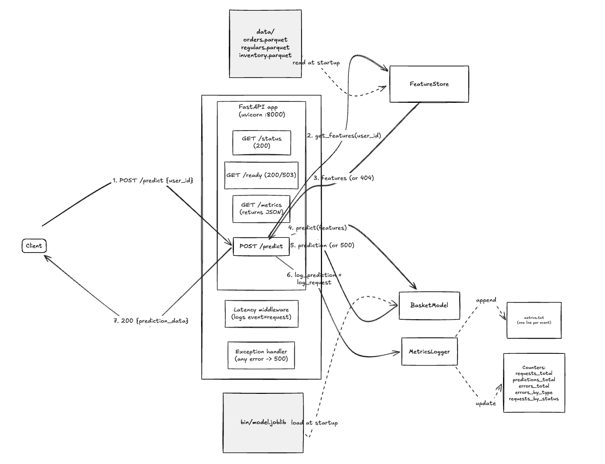

# Basket price prediction API

HTTP API built with **FastAPI** that serves a regression model to predict the basket value of a given user based on their order history.

## Description

Given a `user_id`, the API:

1. Looks up the user's features in a *feature store* built from the parquet files in `data/`.
2. Feeds the features to the serialized model (`bin/model.joblib`).
3. Returns the prediction together with inference timing metrics.

In addition, the service writes operational and model metrics to a `metrics.txt` file, and exposes cumulative in-memory counters via `GET /metrics`.

## Architecture



Main components:

- **FastAPI app** (`src/app.py`): exposes the HTTP endpoints and orchestrates the components.
- **FeatureStore** (`src/basket_model/feature_store.py`): loads the parquet files into memory at startup and resolves `user_id → features`.
- **BasketModel** (`src/basket_model/basket_model.py`): wrapper around the `joblib` model.
- **MetricsLogger** (`src/metrics.py`): writes events to `metrics.txt` and keeps thread-safe cumulative counters.

## Requirements

- Python **3.10–3.12**.
- Data in `data/`: `orders.parquet`, `regulars.parquet`, `inventory.parquet` (available at `s3://zrive-ds-data/groceries/sampled-datasets/`).
- Model in `bin/model.joblib` (available at `s3://zrive-ds-data/groceries/trained-models/model.joblib`).


## Running the API locally

### Option A: plain Python

```bash
cd zrive/module_7
pip install -r requirements.txt
python -m src.app
```

The API will be listening on `http://localhost:8000`.

### Option B: Docker (recommended)

```bash
cd zrive/module_7
docker build -t basket-api .
docker run --rm -p 8000:8000 basket-api
```

## Endpoints

| Method | Path       | Description |
|--------|------------|-------------|
| GET    | `/status`  | Liveness probe. Returns `200` whenever the process is responsive. |
| GET    | `/ready`   | Readiness probe. Returns `200` if model and feature store are loaded; `503` otherwise. |
| GET    | `/metrics` | Returns the cumulative in-memory counters as JSON. |
| POST   | `/predict` | Receives a `user_id` and returns the predicted basket value. |

### `POST /predict`

**Request:**

```json
{ "user_id": "004b3e3cb9a9f5b0974ce4179db394057c72e7a82077bfe6a28af9e6306ebc51b0d8c5c8bd4c9b59ebb3237827df723745c1374d12ad2053e0131edc184df17d" }
```

**Response (200):**

```json
{
  "user_id": "004b3e3c...df17d",
  "predicted_basket_value": 40.6352,
  "inference_ms": 1.23,
  "feature_lookup_ms": 0.45
}
```

### `curl` examples

```bash
curl http://localhost:8000/status
curl http://localhost:8000/ready
curl http://localhost:8000/metrics

curl -X POST http://localhost:8000/predict \
  -H "Content-Type: application/json" \
  -d '{"user_id": "<USER_ID>"}'
```

## Error handling

| Code | When it is returned |
|------|---------------------|
| 200  | Successful request. |
| 404  | `user_id` not found in the feature store. |
| 422  | Invalid payload (missing or empty `user_id`). |
| 500  | Model inference failure or unexpected error. |
| 503  | Service not ready (model or feature store not loaded). |

Every error is logged as an `event=error` entry in `metrics.txt` and reflected in `errors_by_type` from the `/metrics` endpoint.

## Metrics

`MetricsLogger` writes **one line per event** to `metrics.txt`. Three event types are produced:

### `event=request` (one per HTTP request)

```
timestamp=... | event=request | endpoint=/predict | method=POST | status_code=200 | latency_ms=2.78
```

### `event=prediction` (one per successful prediction)

```
timestamp=... | event=prediction | user_id=... | prediction=40.6352 | inference_ms=1.23 | feature_lookup_ms=0.45 | n_features=4
```

- `inference_ms`: time spent in `model.predict` alone.
- `feature_lookup_ms`: time spent resolving `user_id → features` in the feature store.
- `n_features`: length of the feature vector.

### `event=error` (one per handled error)

```
timestamp=... | event=error | endpoint=/predict | error_type=UserNotFound | message=...
```

### In-memory counters — `GET /metrics`

```json
{
  "requests_total": 152,
  "predictions_total": 120,
  "errors_total": 8,
  "errors_by_type": { "UserNotFound": 7, "PredictionFailed": 1 },
  "requests_by_status": { "200": 140, "404": 7, "500": 1, "503": 4 }
}
```

## Tests

```bash
cd zrive/module_7
pip install -r requirements.txt pytest
python -m pytest tests/ -v
```

Tests use `fastapi.testclient` with an injected `FakeFeatureStore` and `FakeModel`, so they do not depend on the real parquet files or model.

